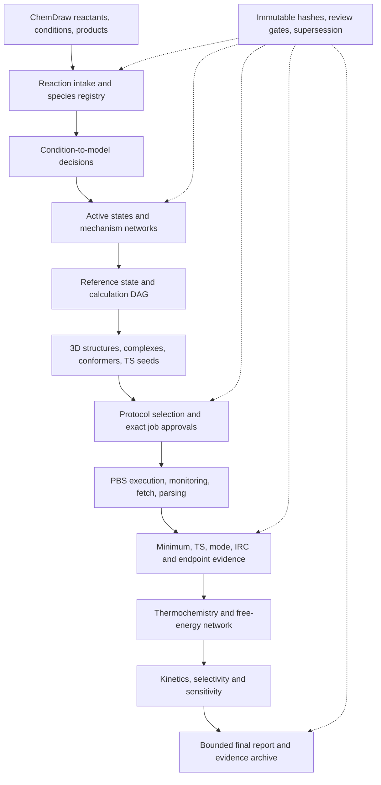

# End-to-end reaction computation workflow

Status: target architecture and implementation roadmap. This document grants no
Gaussian, SSH, PBS, deployment, retry, cancellation, or server-data authority.

Status date: 2026-07-14

## 1. Project objective

The final project should accept, at minimum, a reviewed ChemDraw reaction
package containing reactants, experimental conditions, and products, and turn
it into a reproducible computational study. The intended result is not an
automatically “proven mechanism.” It is:

> an auditable set of mechanistic hypotheses, calculated and validated under
> explicit chemical models, with bounded thermodynamic, kinetic, and
> selectivity conclusions.

A synthetic reaction drawing is only the experimental intake. It normally does
not identify the active catalyst, catalyst activation sequence, protonation or
ion-pair state, unshown byproducts, elementary steps, conformer space,
selectivity-determining step, reference basin, electronic-structure method, or
transition-state geometry. Those items must become explicit reviewed
hypotheses before calculation.

The target system is therefore a human-in-the-loop scientific orchestrator:

- automation owns transcription, normalization, hashes, deterministic
  enumeration, calculation bookkeeping, result parsing, evidence checks,
  aggregation, and reproducible reporting;
- scientific review owns ambiguous chemical identity, active-state and
  mechanism hypotheses, model inclusion/exclusion, protocol choice, transition
  mode interpretation, endpoint identity, and final claim approval; and
- execution remains behind exact, immutable, stage-scoped approval gates.

## 2. Target outputs

A complete supported study should produce all of the following:

1. a source-exact and normalized reaction-intake package;
2. a stable species registry and reviewed atom maps;
3. an explicit mapping from experimental conditions to the computational
   environment model;
4. one or more reviewed mechanism networks, including catalyst activation and
   competing active states where applicable;
5. a calculation DAG covering minima, conformers, complexes, transition-state
   families, paths, endpoints, and sensitivity calculations;
6. immutable inputs, approvals, job records, logs, checkpoints, parsed results,
   and scientific review decisions;
7. a common-reference thermochemical profile and, when justified, a kinetic or
   selectivity model; and
8. a final report whose wording is limited by mechanism coverage, calculation
   evidence, model sensitivity, and unresolved alternatives.

The system must preserve failed, rejected, duplicate, wrong-mode, and
superseded work. Completion is defined by the declared scientific scope and
coverage gates, not by the number of successful Gaussian jobs.

## 3. Layered architecture

Do not create one monolithic Skill that silently mixes chemistry, numerical
methods, execution, and interpretation. Use a top-level reaction-study
orchestrator that references specialist, hash-bound artifacts.



The intended ownership is:

| Layer | Owning component | Responsibility |
| --- | --- | --- |
| structure and scheme intake | `chemdraw-structures` | strict reconstruction, identities, stereochemistry, editable source, source-exact conditions |
| 2D-to-3D review | `chemdraw-gaussian-pipeline`, `gaussian-view-rt-win` | audited main-group Cartesian structures, conformer candidates, visible review |
| reaction-study orchestration | future top-level module | species registry, condition model, mechanism network, calculation DAG, study state |
| asymmetric-catalysis domain | `gaussian-asymmetric-catalysis` | catalyst/channel/candidate coverage, result ingestion, ensemble selectivity |
| protocol selection | `gaussian-rtwin-pbs` protocol gate | reviewed `loose`/`standard`/`strict` candidates and explicit selection |
| live execution | `gaussian-rtwin-pbs` | fresh SDL projects, transfer hashes, PBS lifecycle, fetch, generic result parsing |
| TS scientific evidence | `gaussian-ts-irc` | TS/Freq, mode review, checkpoint lineage, IRC, endpoint evidence |
| future energy/kinetic layer | future top-level module | balanced free energies, profiles, energetic span or microkinetics, uncertainty |

The top-level orchestrator must not duplicate the specialist parsers. It should
index their immutable artifacts, enforce dependencies, expose blockers, and
resume from the last accepted gate.

## 4. End-to-end lifecycle

### R00 — Study charter and claim scope

Before interpreting the drawing, state what the study is intended to answer:

- reaction feasibility or thermodynamics;
- one proposed elementary barrier;
- comparison of competing mechanisms;
- regio-, diastereo-, or enantioselectivity;
- catalytic turnover and resting state; or
- a bounded reproduction of a literature calculation.

Record experimental yield/selectivity and uncertainty, source references,
temperature, concentration, pressure, time, and the intended claim ceiling.
Distinguish the selectivity-determining step from the turnover-limiting step.

Gate R00 passes only when the target claims and explicit non-goals are
reviewed. “Calculate the whole reaction” is not yet a calculation plan.

### R01 — Strict reaction intake

Parse the ChemDraw source without treating labels as chemically complete
structures. Preserve both source-exact and normalized representations of:

- every reactant and product;
- precatalyst, ligand, reagent, additive, base/acid, counterion, oxidant,
  reductant, atmosphere, solvent, workup, and purification entry;
- equivalents, mol%, concentration, pressure, temperature, time, yield, ee,
  dr, and regioselectivity; and
- arrows, step boundaries, stereochemical annotations, abbreviations, and
  unresolved text.

Each visible chemical participant should be an editable structure or an
explicitly unresolved abbreviation. Never convert unreadable or omitted
information into a precise chemical model.

Gate R01 requires reviewed constitution, represented form, charge,
protonation, salt/solvate status, isotope, and stereochemistry for every species
needed by the intended study. Unresolved optional information may remain, but
its effect on later gates must be explicit.

### R02 — Species registry, balance, and atom identity

Create stable species and atom identities independently from any one geometry.
The registry must distinguish:

- one chemical identity from its conformers;
- precatalyst from active catalyst states;
- free, associated, ion-paired, solvated, protonated, oxidized, and reduced
  forms;
- workup product from the species formed under catalytic conditions; and
- explicit molecular components from continuum or chemical-potential terms.

Generate a proposed atom map between the drawn reactants and products, then
review it. Make hydrogens explicit when proton or hydride transfer matters.
Check elemental and charge balance, but recognize that a synthetic scheme often
omits bases, counterions, salts, gases, and byproducts and is therefore not an
elementary balanced equation.

Gate R02 passes only after every imbalance is resolved, assigned to an explicit
unshown species, assigned to workup, or retained as a blocker. Atom maps used by
later TS work must be contiguous, stable, and hash-bound.

### R03 — Experimental-condition to computational-model mapping

Transcribed conditions do not automatically define a computational model. For
each solvent, additive, counterion, base, acid, gas, and reagent, record one of:

- represented as an explicit molecular component;
- represented by a continuum/environment model;
- represented by a concentration, pressure, or chemical-potential term;
- excluded as a reviewed spectator or workup component; or
- unresolved and blocking.

Also record experimental temperature, standard-state convention,
concentrations, catalyst loading, and whether ion pairing, aggregation,
protonation, solvent coordination, or additive binding is expected to alter
the active state.

Gate R03 requires a condition model for each mechanism hypothesis. It must not
infer that an experimental solvent name authorizes one particular continuum
model or that an additive is irrelevant because it is not in the product.

### R04 — Active states and mechanism-network hypotheses

Build one or more reviewed directed reaction networks. A node is a complete
chemical state with atom inventory, charge, multiplicity, stereochemistry,
coordination, and environment model. An edge is one elementary step with:

- reactant and product state IDs;
- explicit atom correspondence;
- forming, breaking, and transferring coordinates;
- molecularity and assumed reversibility;
- catalyst oxidation, spin, ligand, coordination, or protonation changes;
- stereochemical product channel; and
- evidence and confidence for inclusion.

For catalysis, include precatalyst activation, active catalyst hypotheses,
resting states, catalyst regeneration, and plausible off-cycle or poisoning
states when they affect the claim. Verify whether the proposed catalytic cycle
actually closes. Do not infer the active catalyst from the precatalyst drawing.

Competing mechanisms remain separate network hypotheses. Exclusion requires a
reviewed reason; absence from the first drawn mechanism is not an exclusion.

Gate R04 passes when at least one bounded network and its relevant alternatives
have been reviewed. It does not mean the mechanism has been proven.

### R05 — Reference basins and kinetic model

Before calculating energies, define how every barrier and equilibrium will be
referenced. Record:

- separated-species versus pre-reactive-complex references;
- standard state and concentration corrections per molecular species;
- explicit solvent, additive, counterion, and ion-pair chemical potentials;
- conformer and catalyst-state equilibration assumptions;
- symmetry and degeneracy conventions;
- reversible steps and product interconversion; and
- the intended aggregation model.

Use an ensemble transition-state model only when the contributing states are
assumed to equilibrate appropriately. Use an explicit kinetic network when
multiple steps, slow catalyst-state exchange, reversible selectivity, or
product interconversion matter. Never compare barriers with different atom
inventories without a balanced thermodynamic cycle.

Gate R05 passes when every planned comparison has a common energy zero or a
reviewed balanced cycle and an explicit model connecting calculated energies
to the target claim.

### R06 — Scientific protocol and resource selection

Define calculation needs by family: minima, conformer refinement, TS/Freq,
IRC, endpoints, single points, spin states, method sensitivity, and optional
analyses. For every new need:

1. create exactly three reviewed protocol candidates named `loose`,
   `standard`, and `strict`;
2. block scientifically unresolved or unsupported candidates;
3. record an explicit hash-bound selection;
4. choose `simple`, `general`, or `complex` resources independently; and
5. render an exact input only after selection.

The protocol must define method, basis/ECP by element, dispersion, solvent,
grid, SCF and convergence policy, frequency/thermochemistry treatment,
temperature, standard state, low-frequency policy, single-point relationship,
and validation expectations. Literature methods are candidates, not defaults.

Gate R06 authorizes only offline input drafting. Every exact live input or
finite batch still needs its own displayed hashes, resources, fresh projects,
and explicit live approval.

### R07 — Three-dimensional state and candidate construction

Construct structures hierarchically rather than embedding only the drawn
overall reaction:

1. isolated species and catalyst components;
2. relevant conformers and ligand rotamers;
3. precatalyst activation and active-state geometries;
4. reactant complexes, ion pairs, explicit-solvent/additive arrangements, and
   substrate binding modes;
5. intermediates and product complexes; and
6. TS approach topologies for every declared channel and mechanism edge.

Preserve stereochemistry, atom maps, coordination, hapticity, component
identity, and geometry provenance. Use force-field or other approved low-level
energies only for prescreen ranking. Deduplicate only within chemically
compatible state/channel boundaries, and retain exclusion evidence.

Gate R07 promotes immutable reviewed candidates. Promotion never means that a
candidate is the only relevant conformer or that it is approved for execution.

### R08 — Minimum and conformer ensemble calculations

Before interpreting a reaction path, validate the reference states that feed
it. For every retained minimum candidate, require:

- normal optimization termination and stationary-point evidence;
- a complete frequency calculation with zero imaginary frequencies;
- unchanged identity, stereochemistry, charge, multiplicity, coordination,
  and intended association state;
- clustering of starting candidates that collapse to the same optimized
  structure; and
- consistent Opt/Freq/single-point thermochemistry under the approved stack.

Build ensembles for each chemical basin using comparable Gaussian free
energies, not force-field rankings. Preserve alternative active states even if
one is higher unless an approved pruning rule excludes it.

Gate R08 produces reviewed minimum ensembles and their common-reference free
energies. A successful optimization that changes the intended chemical state
is a result for a different state, not acceptance of the original candidate.

### R09 — Transition-state family construction and search

For every elementary edge and stereochemical channel, build a TS candidate
matrix across catalyst states, binding modes, conformers, approach topologies,
ion-pair/additive placements, and electronic states. Do not reduce an
asymmetric study to one hand-built “major” and one “minor” structure.

Choose a reviewed seed strategy per family:

- Hessian-guided single guess when a defensible TS-like geometry exists;
- QST2/QST3 when validated endpoints and exact atom correspondence exist and
  installed-Gaussian syntax is verified;
- reviewed relaxed-coordinate scan followed by separately promoted guesses;
  or
- a future explicitly supported path/chain method.

The system must retain unsuccessful searches, wrong saddles, mode collapse,
ligand loss, duplicate convergence, and search-family provenance. It may
prioritize a finite calculation budget, but resource limits must not be
misreported as complete chemical coverage.

Gate R09 promotes exact TS search inputs only after seed geometry, intended
coordinate, chemical/electronic state, protocol, and expected evidence are
reviewed.

### R10 — Calculation DAG and live execution

Represent the study as a dependency DAG rather than independent shell
commands. Typical dependencies include:

```text
minimum Opt/Freq/SP
  -> TS seed promotion
  -> TS/Freq
  -> mode decision
  -> checkpoint audit
  -> forward/reverse IRC
  -> endpoint identity and endpoint Opt/Freq
  -> energy/kinetic analysis
```

Each job node must contain immutable parent hashes, exact input hash, route,
resources, fresh project, expected outputs, approval state, and retry lineage.
Execution remains confined below `/home/user100/SDL`, refuses non-empty or
symlinked projects, submits exactly once, and never deletes server data.

Queued work is a valid state. Do not create duplicates, reduce resources,
change chemistry, or cancel because a job remains queued. After exact live
approval, monitoring/fetch/parsing may run unattended inside the approved job
scope.

Gate R10 is per exact job or explicitly enumerated finite batch. A parent job's
approval never authorizes an IRC, endpoint, sensitivity job, retry, or new
candidate.

### R11 — Terminal intake and scientific evidence

Separate operational completion from scientific acceptance.

For minima, require zero imaginary frequencies and structural/state identity.
For a TS, require normal stationary/Freq evidence, exactly one raw imaginary
frequency, and a hash-bound manual review that its displacement follows the
declared chemical coordinate. A frequency count or numerical agreement with a
paper is insufficient.

For supported closed-shell main-group cases, require separately approved
forward and reverse IRC directions and reviewed endpoint identities before a
path claim. Endpoint labels must come from structures, not numerical direction
names. Validate connected minima or explicitly reviewed disconnected
fragments.

For future metal work, additionally require electronic-state, wavefunction,
spin-contamination, coordination, hapticity, ligand inventory, and surface
checks. Ordinary main-group IRC evidence must not be reused as a metal path
model.

Gate R11 assigns evidence levels only:

- `minimum_candidate`;
- `validated_minimum_under_protocol`;
- `first_order_saddle_candidate`;
- `mode_consistent_ts`;
- `path_validated_ts`; or
- `failed`, `incomplete`, or `inconclusive`.

### R12 — Thermochemistry and free-energy network

Build a free-energy profile from validated states while preserving separate:

- frequency-level zero-point, thermal, enthalpy, and Gibbs corrections;
- final single-point electronic energies;
- composite-energy definitions;
- standard-state corrections per independently treated species;
- low-frequency treatment and sensitivity; and
- conformer, symmetry, and degeneracy contributions.

Every network edge should report the exact formula for its forward and reverse
barriers and reaction free energy. Missing species, unbalanced explicit
components, mixed protocols, or mixed reference definitions block the edge
rather than producing a visually complete but invalid profile.

Gate R12 produces a comparable, hash-bound thermochemical network. It does not
by itself establish which network hypothesis is kinetically relevant.

### R13 — Kinetics, selectivity, and uncertainty

Choose the simplest model justified by R05:

- Boltzmann/transition-state ensemble for rapidly equilibrating candidate
  families under one stated mechanism;
- energetic-span or related catalytic-cycle summary when its assumptions are
  reviewed; or
- explicit microkinetic/kinetic-network analysis for coupled reversible steps,
  catalyst-state populations, concentrations, and product interconversion.

For asymmetric calculations, aggregate all retained comparable TS candidates
per product channel before predicting ee/dr/regioselectivity. Report channel
coverage, degeneracies, exclusions, missing plausible candidates, and whether
one candidate within a reasonable uncertainty range could reverse the order.

Sensitivity should cover, as applicable, conformer omission, candidate
leave-one-out, energy perturbation, protocol/method matrix, solvation,
low-frequency policy, standard state, catalyst-state population, spin state,
and alternative mechanism networks.

Gate R13 may produce `provisional`, `inconclusive`, or `validated under the
stated mechanism, protocol, kinetic model, and reviewed coverage`. Agreement
with experimental ee or rate does not prove a unique mechanism.

### R14 — Report, archive, and supersession

The final report should contain:

- source reaction and normalized intake;
- hypotheses included, excluded, and unresolved;
- complete species/network/candidate coverage;
- protocol and resource decisions;
- job and evidence lineage;
- optimized structures, frequencies, modes, paths, and endpoint identities;
- energy definitions, profiles, kinetics/selectivity, and uncertainty;
- comparison with experiment; and
- an exact claim level and limitations.

All review decisions and later calculations create new immutable artifacts.
New evidence supersedes prior analyses without editing their history. Logs,
checkpoints, server scratch, credentials, and operational live bundles remain
outside version-controlled scientific summaries.

## 5. Top-level gates and state machine

The future orchestrator should expose the following project gates:

| Gate | Required decision | State after passing |
| --- | --- | --- |
| G0 | target claim and source package accepted | `intake_scoped` |
| G1 | species identities, stereochemistry, balance, atom maps reviewed | `reaction_reviewed` |
| G2 | condition model, active states, mechanism networks reviewed | `hypothesis_space_reviewed` |
| G3 | references, kinetic model, protocols, and candidate dimensions reviewed | `calculation_model_reviewed` |
| G4 | exact 3D minima/TS candidates promoted | `candidate_inventory_reviewed` |
| G5 | exact input hashes, resources, fresh projects, and live scope approved | `jobs_authorized` |
| G6 | terminal evidence parsed and scientific state/mode checks reviewed | `calculation_evidence_reviewed` |
| G7 | path/endpoints or documented claim-limiting alternatives reviewed | `network_evidence_reviewed` |
| G8 | comparability, coverage, aggregation, kinetics, sensitivity reviewed | `analysis_reviewed` |
| G9 | wording and archive accepted | `study_completed_under_stated_model` |

The project must be resumable from any gate. A blocked branch of the mechanism
network must not erase progress in another branch, and a successful child job
must not automatically promote its parent scientific hypothesis.

## 6. Planned top-level data contracts

Existing specialist schemas should remain authoritative for their own
artifacts. The missing top-level layer should add only the following contracts:

| Planned artifact | Purpose |
| --- | --- |
| `gaussian-reaction-intake/1` | source ChemDraw hashes, normalized components, source-exact conditions, claim scope, unresolved transcription |
| `gaussian-reaction-species-registry/1` | stable identities, represented forms, stereochemistry, charge/multiplicity, atom IDs, structure hashes |
| `gaussian-reaction-condition-model/1` | explicit/continuum/chemical-potential/excluded treatment for every experimental condition component |
| `gaussian-reaction-network/1` | complete-state nodes, elementary-step edges, atom maps, channels, reversibility, active-state and evidence hypotheses |
| `gaussian-reaction-study-index/1` | read-only index of the current immutable evidence DAG, derived project state, blockers, and next safe offline action |
| `gaussian-reaction-calculation-plan/1` | calculation DAG, candidate and protocol bindings, dependencies, budgets, approval and support status |
| `gaussian-calculation-attempt/1` | one exact input/run/restart/recalc lineage without mutating or replacing its parent attempt |
| `gaussian-reaction-evidence-index/1` | immutable index of minimum, TS, mode, IRC, endpoint, energy and failure artifacts |
| `gaussian-reaction-free-energy-network/1` | common-reference energies, barrier formulas, standard-state and low-frequency policy, blocked edges |
| `gaussian-reaction-kinetic-analysis/1` | ensemble or external kinetic model, concentrations, rates/selectivity, sensitivity and limitations |
| `gaussian-reaction-study-report/1` | final claim, coverage, evidence hashes, supersession and reproducibility summary |
| `gaussian-recalculation-decision/1` | explicit cause, unchanged/changed scope, parent evidence, new protocol/input/project requirements |

All contracts should use strict JSON loading, finite numbers, one-based atom
indices, stable IDs, exact SHA-256 dependencies, fail-closed schema handling,
immutable review decisions, and explicit `no_submission_authorization` where
appropriate.

## 7. Failure, retry, and `recalc` semantics

`recalc` should be a first-class reviewed state transition, not a loose keyword
for “try something else.” Every follow-up calculation must be classified as:

1. **transport/scheduler replay** — Gaussian did not begin and the exact input
   is intended to be rerun in a fresh project;
2. **exact scientific rerun** — the same immutable input is repeated for a
   documented reproducibility or infrastructure reason;
3. **checkpoint continuation** — an approved restart/IRC/endpoint bound to an
   audited checkpoint and its original input/result lineage;
4. **numerical recalculation** — SCF, optimization, grid, integrator, or
   convergence settings change;
5. **model recalculation** — method, basis/ECP, solvent, thermochemistry,
   spin/wavefunction, reference state, or explicit components change; or
6. **new scientific candidate** — geometry, catalyst state, mechanism,
   coordination, channel, or atom inventory changes.

Classes 4–6 require a new calculation need, three-tier proposal, explicit
selection, rendered input hash, fresh project, and live approval. Class 3
requires the owning checkpoint/path gate. Classes 1 and 2 still require exact
approval under the current repository policy and never reuse a non-empty
server directory.

No failure authorizes automatic route changes, geometry edits, spin changes,
candidate replacement, resubmission, or deletion. The failure artifact should
record the diagnostic evidence and the highest scientifically valid parent
state before any recalculation is proposed.

## 8. Current implementation status

The repository currently implements important specialist slices, but not the
top-level reaction workflow.

| Capability | Current status | Boundary |
| --- | --- | --- |
| ChemDraw molecule reconstruction and stereochemical review | partial in repository | the installed `chemdraw-structures` copy has a newer strict reaction-package workflow, but repository source currently drifts and must be reconciled |
| ChemDraw/CDX/MOL/SDF to audited Cartesian input | implemented for reviewed, mainly ordinary main-group structures | no automatic metal, ion-pair, active-catalyst, or TS model |
| connected-molecule conformer generation and promotion | implemented | ETKDG/MMFF/UFF is prescreening; disconnected complexes, metal coordination, and axial chirality need manual/specialized support |
| reaction intake/species registry/stoichiometric balance/atom-map proposal | missing as a versioned top-level contract | current tools can parse structures, but do not build a complete reaction study from a scheme |
| condition-to-model mapping | missing | solvent/additive/counterion treatment remains manual and unstructured across a whole study |
| mechanism network and catalyst-cycle DAG | partially represented in asymmetric study artifacts | no general network builder, cycle closure audit, step dependency engine, or project-level state machine |
| deterministic asymmetric study/candidate ledgers | implemented offline in repository | `gaussian-asymmetric-catalysis` is not yet deployed; geometry construction still requires reviewed XYZ/atom maps |
| chiral-boron center/coordination/binding/conformer/approach enumeration | implemented at logical-ledger level | chemistry-aware complex construction, conformer generation, and broader real-system validation are missing |
| transition-metal state/search design | M0 and candidate-bound M2a implemented offline | calculation input, parser, wavefunction/coordination acceptance, path model, and all live submission remain intentionally refused |
| protocol `loose`/`standard`/`strict` proposal and selection | implemented as a standalone gate | does not choose a protocol or authorize input submission; the current generic automatic execution entry does not yet require and consume the selection artifact end to end |
| guarded PBS submit/watch/fetch/analyze | implemented per approved job | no whole-study job DAG, dependency scheduler, finite-batch approval manifest, or project-level resume engine |
| minimum Opt/Freq/single-point parsing and conformer aggregation | implemented per reviewed structure/family | no reaction-wide species registry, post-optimization identity clustering, or balanced free-energy network |
| TS/Freq parsing, manual mode decision, checkpoint audit, bidirectional IRC and endpoints | implemented for reviewed supported main-group families in repository source | no TS discovery engine; QST raw input generation remains disabled; deployed copy currently trails repository terminal-intake changes; metal remains refused |
| TS candidate-space result ingestion and two-channel Boltzmann/ee sensitivity | implemented offline | only `boltzmann_ts_ensemble`; no general kinetic network, energetic-span engine, or protocol-matrix uncertainty propagation |
| final project report and claim-state engine | missing | current documents and analyses are study-specific rather than generated from one top-level evidence index |

The BF3 benchmark demonstrates reviewed literature-coordinate intake,
hash-bound TS/Freq execution, mode review, and prepared IRC/terminal intake. It
does not yet demonstrate a reaction beginning from ChemDraw, active-state and
mechanism construction, all relevant minima, full path validation, a free-
energy cycle, or selectivity prediction.

The three current examples are complementary but disconnected vertical slices:

- CAT2 records a real experimental reaction and correctly stops at unresolved
  active-state, atom-map, mechanism, structure, and protocol questions;
- BF3 exercises literature candidate coordinates through TS/Freq and path-
  evidence preparation; and
- the synthetic boron fixtures exercise candidate/result/ensemble ee
  aggregation.

The final orchestrator must connect those slices without requiring a reviewer
to hand-edit JSON between them.

## 9. Critical gaps

### P0 — Repository and runtime integrity

- reconcile `chemdraw-structures` so the richer deployed reaction intake is
  reviewed, tested, and version-controlled rather than existing only in the
  installed copy;
- deploy the repository `gaussian-asymmetric-catalysis` Skill only after named
  validation and exact diff review;
- synchronize the repository `gaussian-ts-irc` terminal-intake/protocol changes
  into its deployed copy; and
- keep all further work on a feature branch with offline validation before a
  live smoke test.

### P1 — Missing top-level scientific model

- reaction intake, species registry, balance, and atom-map contracts;
- condition-to-model decisions;
- mechanism-network/catalyst-cycle representation;
- common-reference and kinetic-model contracts; and
- calculation DAG, project state, and evidence index.

It also needs explicit artifact adapters for:

- promoted candidate plus protocol selection to the exact rendered input and
  manifest;
- candidate ledger to dependency-aware calculation targets and terminal-intake
  plans; and
- fetched PBS/TS evidence to minimum/TS energy records and the reaction-level
  evidence index.

Without P1, existing tools calculate reviewed individual structures but cannot
prove that the declared whole-reaction scope is covered.

### P2 — Missing structure and TS construction

- chemistry-aware assembly of catalyst/substrate complexes, ion pairs,
  explicit additives, and binding modes;
- conformer/rotamer generation for disconnected and coordinated systems;
- post-optimization identity, coordination, and duplicate clustering;
- reviewed relaxed-scan execution and promotion;
- verified QST2/QST3 input construction for the installed G16 revision; and
- a general strategy for generating, ranking, and reopening TS guesses.

### P3 — Missing reaction-level analysis

- balanced thermodynamic cycles and automatic stoichiometric reference checks;
- reaction-wide free-energy profiles;
- explicit low-frequency and standard-state sensitivity matrices;
- energetic-span or microkinetic analysis;
- multi-mechanism/model comparison and uncertainty propagation; and
- generated final reports with machine-checked claim ceilings.

### P4 — Unsupported transition-metal runtime

- one concrete M1 scientific example;
- metal-specific input and result contracts;
- oxidation/electron count, spin, wavefunction stability and contamination
  checks;
- coordination/hapticity/ligand-loss checks before and after optimization;
- single-reference adequacy and escalation policy;
- metal TS/path validation semantics; and
- M3 adversarial fixtures and a separately approved small M4 smoke test.

## 10. Implementation roadmap

### W0 — Reconcile and freeze the baseline

Bring the repository and named deployed Skills back into one reviewed state.
Acceptance requires exact diff review, structural validation, existing tests,
new tests for imported reaction-intake behavior, no secrets, and zero unrelated
files.

### W1 — Reaction intake foundation

Implement `reaction-intake`, `species-registry`, and `condition-model` schemas,
builders, semantic validation, and strict fixtures. Use a real catalytic
ChemDraw scheme as a fixture but require unresolved active-state fields to
remain blocked.

Use the existing CAT2 study as the first “correctly blocked” real-reaction
acceptance case: it should advance from source intake to a precise question and
blocker inventory without manufacturing an active catalyst, atom map, candidate
geometry, protocol, or selectivity ensemble.

Acceptance tests should cover salts, implicit hydrogens, catalyst/ligand
separation, unshown byproducts, workup products, ambiguous stereochemistry,
equivalents/mol%, and source-exact versus normalized condition text.

### W2 — Mechanism network and calculation DAG

Implement immutable state nodes, elementary edges, atom maps, catalyst-cycle
closure checks, competing network hypotheses, reference basins, job
dependencies, and project gate transitions. The first version should plan only
and must not submit.

Add the read-only study index here. It should derive current state and the next
safe action from hashes and accepted decisions rather than store a manually
editable status flag.

Acceptance requires deterministic rebuilds, hash-drift refusal, cycle and mass/
charge diagnostics, blocked unsupported states, and resume from every gate.

### W3 — Closed-shell main-group minima workflow

Connect reviewed species/conformer ensembles to the existing Opt/Freq/single-
point workflow. Add post-optimization identity and duplicate clustering plus a
reaction-wide free-energy network.

Use a small, closed-shell, one-step literature reaction as the first complete
offline/live smoke candidate only after exact approval. It should be much
smaller than the full BCF benchmark and should exercise reactant/product
minima, not only a TS geometry.

### W4 — Closed-shell main-group TS workflow

Add one reviewed TS-seed construction route, calculation-DAG integration,
terminal intake, mode review, bidirectional IRC, endpoint minima, and path
evidence. Preserve QST and scan strategies as blocked until their installed-
revision and execution contracts are complete.

Acceptance requires an entire elementary reaction from normalized ChemDraw
input through identified minima, mode-consistent TS, both endpoints, and a
common-reference barrier.

### W5 — Asymmetric ensemble workflow

Connect the reaction network to `gaussian-asymmetric-catalysis`, add chemistry-
aware complex materialization, calculate all retained candidates under a
common protocol, and aggregate product-channel ensembles.

Acceptance requires at least two stereochemical channels, reviewed-pruned or
complete coverage by every declared dimension, leave-one-out and energy/model
sensitivity, and a claim that remains explicitly conditional on the stated
mechanism.

### W6 — Multi-job orchestration and recalculation

Implement the finite calculation DAG, dependency-aware readiness, immutable
job manifests, exact batch review, queue-safe resume, terminal intake, evidence
indexing, and `gaussian-recalculation-decision/1`. Do not create an automatic
chemistry-changing retry policy.

### W7 — Reaction kinetics and reporting

Implement balanced profiles, an external hash-bound or native kinetic-network
model, concentration/temperature scenarios, uncertainty matrices, and the
final claim/report generator.

### W8 — Transition-metal extension

Complete M1 on one bounded metal–chiral-ligand reaction, then M2/M3 contracts,
parsers, negative fixtures, and execution-boundary review. Only after those
pass may a small closed-shell single-reference metal smoke test be proposed.
Do not use a large asymmetric catalyst as the first metal runtime test.

### W9 — Broader production validation

Validate the orchestrator on:

1. one small closed-shell non-metal elementary reaction;
2. one two-channel asymmetric main-group reaction;
3. one multi-step catalytic-cycle study with an explicit kinetic model; and
4. only then one bounded transition-metal example.

Each benchmark should test a different scientific layer rather than repeatedly
testing only PBS transport.

## 11. Definition of project completion

The project reaches its intended end state when all of the following are true:

- a supplied ChemDraw reaction and conditions produce a deterministic,
  reviewed intake package without losing source text or stereochemistry;
- ambiguous identities, missing species, balance, active states, mechanisms,
  electronic states, and computational models become explicit blockers rather
  than guesses;
- after human review, the system can build a complete declared candidate and
  calculation DAG with stable atom and artifact identities;
- supported jobs can be prepared, approved, executed, monitored, fetched, and
  resumed without overwriting, duplicate submission, or provenance loss;
- minima, TS modes, paths, endpoints, thermochemistry, and selectivity/kinetics
  receive the correct evidence gates;
- failed and recalculated work remains explainable and immutable;
- the final report can be regenerated from artifacts and cannot exceed its
  mechanism, protocol, path, coverage, or sensitivity evidence; and
- closed-shell main-group, asymmetric ensemble, catalytic-network, and later
  transition-metal benchmark suites pass offline and their separately approved
  live smoke tests.

The desired automation is therefore not “ChemDraw in, unquestionable mechanism
out.” It is “ChemDraw in, every scientific assumption made explicit, every
calculation reproducible, and every conclusion no stronger than its evidence.”
