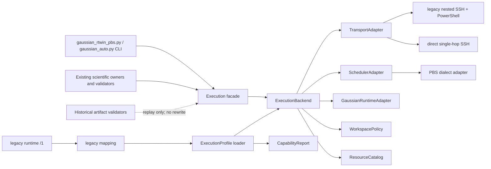
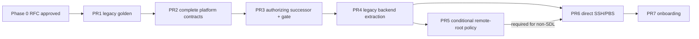

# Auto-G16 v2.6 平台可移植性基础 RFC

状态：Accepted；三项仓库所有者决议已于 2026-07-22 确认；本修订仍须 independent L2
确认最后一个 legacy attestation P1 已关闭后才可作为实现合同；不构成实现或运行授权<br>
任务分类：Feature development / L2 contract and compatibility review<br>
审阅基线：`aa1c4614fc0d1cdecfc445a4db39a70700e2d7c6`<br>
分支：`codex/v26-platform-rfc`<br>
审阅日期：2026-07-22（Asia/Shanghai）

## 1. 摘要与约束

本 RFC 建议将当前唯一的 Mac → RTwin/Windows → PBS/Gaussian 执行链先刻画为
`legacy_rtwin_pbs` backend，再在不改变科学 gate、历史 artifact 或现有 RTwin/PBS
安全语义的前提下增加 `direct_ssh_pbs` backend。v2.6 的完成边界是：

- 闭合、版本化且不含秘密的 execution profile 与 capability report；
- 完全离线的 profile template、validate 和 doctor；
- 通过 golden characterization 证明 legacy 行为没有漂移；
- legacy RTwin/PBS 与 direct SSH/PBS 两个显式 backend；
- profile-bound resource catalog，以及与 profile hash 绑定的 exact resource 人工批准；
- 明确拒绝未知 backend、capability、scheduler dialect、路径、资源或传输状态。

本 RFC 不修改代码或既有 schema。仓库所有者已条件批准第 9 节选项 B；独立 PR5 以
[`v2.6-remote-root-policy.md`](v2.6-remote-root-policy.md) 和 [`AGENTS.md`](../AGENTS.md)
落实仓库策略，但不实现 backend 或使任何非 SDL profile 获得执行能力。legacy 永久固定
`/home/user100/SDL`；在新 backend 的 additive profile/root-evidence/authorization 合同、
owner validator、L3 review 和测试闭合前，所有可执行 backend 仍必须继续使用固定根。

本轮没有 SSH、RTwin、PBS、Gaussian、live smoke、Skill 部署或远程数据访问。

## 2. 基线、发布事实与审阅方法

### 2.1 本轮已核实事实

| 项目 | 2026-07-22 本轮事实 | 证据 |
| --- | --- | --- |
| Git 基线 | `HEAD`、本地 `main` 与刷新后的 `origin/main` 均为 `aa1c4614fc0d1cdecfc445a4db39a70700e2d7c6`，ahead/behind 为 `0/0` | 本轮只读 `git fetch origin --prune --tags` 与 `git rev-parse` |
| PR #49 | 已于 `2026-07-22T05:10:36Z` 合并，merge commit 为上述 SHA | [PR #49](https://github.com/anakine800-tech/Auto-Gaussian/pull/49) |
| tag | annotated tag `v2.5.4` peel 到上述 SHA | 本轮刷新后的 tag refs |
| Release | `Auto-Gaussian 2.5.4` 于 `2026-07-22T05:16:14Z` 发布，非 draft、非 prerelease，当前为 Latest | [v2.5.4 Release](https://github.com/anakine800-tech/Auto-Gaussian/releases/tag/v2.5.4) |
| 仓库版本 | `pyproject.toml`、README、CHANGELOG 与 repository status 均为 2.5.4 | [`pyproject.toml`](../pyproject.toml)、[`README.md`](../README.md)、[`CHANGELOG.md`](../CHANGELOG.md)、[`repository-status.md`](repository-status.md) |

因此，外部交接书中“可能仍无 v2.5.4 tag/Release”的描述已过时。v2.6 可以从已发布的
`v2.5.4` 精确提交开始；开始每个后续 PR 时仍须重新核实 `origin/main`，不能把本次 SHA
当作永久 current。

### 2.2 Preflight 事实

本 linked worktree 初始位于同一基线的 detached HEAD，工作区干净。首次 development
preflight 唯一 blocker 是 detached HEAD；建立用户指定的唯一分支
`codex/v26-platform-rfc` 后，普通、JSON 和 `--require-clean` 三种 preflight 均通过：
branch、linked worktree、clean tree、private-path classification、required files、live
environment 和 test-isolation 全部为 pass。

### 2.3 事实、推断和已决议分栏

| 类型 | 条目 |
| --- | --- |
| 事实 | [`gaussian_rtwin_pbs.py`](../skills/auto-g16-rtwin-pbs/scripts/gaussian_rtwin_pbs.py) 是 6255 行的主执行脚本；它同时拥有输入审计、legacy 配置、nested SSH、PowerShell、PBS、workspace、资源上限、stage/submit/inspect/watch/fetch/cancel 和 CLI。 |
| 事实 | 主脚本构造两跳 `ssh -F ... rtwin ssh -F ... gaussian-server ...`；fetch 另有 Windows PowerShell 编码阶段。 |
| 事实 | 主脚本固定 `DEFAULT_REMOTE_ROOT=/home/user100/SDL`、`MAX_CORES=44`、`MAX_MEMORY_BYTES=120 GiB`；资源模块固定 `simple=(8,12)`、`general=(22,50)`、`complex=(44,120)`。 |
| 事实 | [`gaussian_server.example.json`](../config/gaussian_server.example.json) 描述 scheduler、Gaussian 和资源，但当前执行代码不加载该文件；它不是现行 backend 合同。 |
| 事实 | 旧 runtime `/1` 是九字段 closed schema；PBS 主脚本只直接消费其中 `rtwin_ssh_config`、`windows_project_root`、`windows_server_config`，其余字段由 Python/ChemDraw/GaussView 侧消费或不属于 PBS transport。 |
| 事实 | `qsub`/active-job `qdel` 不自动重试；只有封闭的 read-only snapshot capability 可有限重试。unknown/timeout/parse failure 不得推断 absent。 |
| 事实 | stage 与 proposal 均显式 non-authorizing；当前 resource gate 要求 exact tier/cores/memory/walltime/estimated core-hours，并禁止自动资源改变和自动 retry。 |
| 推断 | 如果直接在 6255 行脚本中增加第二套条件分支，最可能出现的是命令形状、批准重放、unknown 状态或 fetch 完整性漂移。应先冻结 golden，再抽取。 |
| 推断 | profile hash 必须进入最终人工授权的传递闭包，而不能只出现在 capability report；否则批准后替换 backend/root/target 的风险仍存在。 |
| 推断 | PBS dialect 不是单一事实。v2.6 的 direct backend 只能支持被 fixture 明确定义的现行方言；未知输出必须 fail closed。 |
| 已决议 | v2.6 后续实现的精确基线策略、remote-root 政策和支持范围均已由仓库所有者确认，见第 18 节；后续 review gate 不得重新解释或放宽这些决议。 |

## 3. 当前耦合与文件级迁移图

### 3.1 源文件清单

| 当前文件或文件组 | 已核实耦合/合同 | v2.6 处理方式 |
| --- | --- | --- |
| [`AGENTS.md`](../AGENTS.md) 与 [`v2.6-remote-root-policy.md`](v2.6-remote-root-policy.md) | legacy 固定 `/home/user100/SDL`；新 backend root 必须 backend-owned、reviewed、hash-bound 且无 override；submission/cancellation/cleanup 权限边界 | legacy 原样保留；新 backend 只能通过 additive reviewed contracts 实现，代码不得先于合同 |
| [`README.md`](../README.md)、[`end-to-end-reaction-computation-workflow.md`](end-to-end-reaction-computation-workflow.md)、[`auto-g16-rtwin-pbs/SKILL.md`](../skills/auto-g16-rtwin-pbs/SKILL.md) | 描述固定 root、RTwin 链、三档资源、批准和运行语义 | compatibility 文档；实现后才更新 support matrix，不预先宣称支持 |
| [`runtime.example.json`](../config/runtime.example.json)、[`scripts/runtime_config.py`](../scripts/runtime_config.py) | `auto-g16-runtime-config/1` closed schema、no-follow loader、九个 legacy 本机字段 | `/1` 冻结；新增独立 execution profile schema，不原地加字段 |
| `skills/auto-g16-rtwin-pbs/scripts/runtime_config.py` 与 `auto-g16-view-rt-win` 同名 loader | 部署 Skill 的 self-contained legacy loader | 保留 legacy 加载；新增 loader 必须单一 owner 并由 packaging manifest 映射，避免第三份漂移 |
| [`gaussian_server.example.json`](../config/gaussian_server.example.json) | 非执行代码所加载的说明性示例 | 不冒充兼容输入；Phase 1 转写为新的 sanitized template，旧文件继续保留 |
| [`gaussian_rtwin_pbs.py`](../skills/auto-g16-rtwin-pbs/scripts/gaussian_rtwin_pbs.py) | legacy 平台、workspace、PBS、Gaussian runtime、资源、fetch、状态、批准和 CLI 的组合 owner | 先 golden；再保留同名 CLI wrapper，逐步委托给 `legacy_rtwin_pbs` backend |
| [`gaussian_auto.py`](../skills/auto-g16-rtwin-pbs/scripts/gaussian_auto.py) | 直接 import 主脚本，并转发五个 connection 参数与所有 execution/resource 参数 | 保持 CLI；改为调用 backend-neutral facade，禁止重建批准 scope |
| [`gaussian_workflow.py`](../skills/auto-g16-rtwin-pbs/scripts/gaussian_workflow.py) | 从主脚本复用输入解析与 44/120 上限 | 只依赖 Gaussian input/runtime validator 与 ResourceCatalog，不依赖 transport |
| [`resource_efficiency.py`](../skills/auto-g16-rtwin-pbs/scripts/resource_efficiency.py) | 三档 tuple、policy/gate、snapshot、ledger `/3`、accounting、monitor reconciliation | 拆出 catalog；gate、unknown 和 append-only semantics 保持原 owner 语义 |
| [`execution_batch.py`](../skills/auto-g16-rtwin-pbs/scripts/execution_batch.py) | `/2` reservation 中固定 remote workdir；历史 `/1`–`/3` 迁移 | 旧 validator 原样重放；新版本通过 WorkspacePolicy 绑定 profile/root hash |
| [`protocol_selection.py`](../skills/auto-g16-rtwin-pbs/scripts/protocol_selection.py) | 只接受 closed resource tier labels，且 proposal 禁止 server/remote-root/submission 字段 | 保持 proposal 非授权；资源 tuple 由新 catalog 验证，不把科学 protocol 变成执行批准 |
| [`templates/g16_job.pbs.template`](../templates/g16_job.pbs.template) | 固定 SDL root、scratch containment 和 Gaussian 启动形状 | 纳入 legacy golden；新 renderer 生成等价 legacy bytes，direct 另有明确 fixture |
| `contracts/rtwin-pbs/*` | live approvals、execution batches、resource gate/snapshot 等历史合同；部分 schema 固定 SDL 路径 | 不就地修改；旧 validator 永久重放，profile-aware 行为使用新 schema/version |
| `auto-g16-main-group-open-shell/scripts/open_shell_minimum_family.py` | 再次固定三档 tuple | 后续消费 ResourceCatalog 的 legacy view；旧 artifact 仍按原 tuple 验证 |
| `auto-g16-ts-irc/scripts/ts_irc.py` | 固定 SDL 路径、三档 label、transport Skill 名称 | 只改未来 execution handoff；TS/Freq/IRC 科学 gate 不迁入 backend |
| `auto-g16-metal-ts/scripts/metal_ts.py` 与 `contracts/metal-ts/*` | 当前输入批准要求 SDL 路径 | 历史合同不改；direct backend 支持需由 metal owner 独立评审，不在 v2.6 自动扩大 |
| `auto-g16-reaction-workflow/scripts/calculation_artifacts.py`、`scientific_closure_lineage.py` | import/动态加载主执行 owner 的审计或批准函数 | 改为依赖稳定 facade；不得复制 validator 或改变 scientific classification |
| `auto-g16-rtwin-pbs/deployment-package.json` | 当前只额外打包 `contracts/rtwin-pbs` | 新 `contracts/execution` 若获批，必须显式加入 named-Skill package 并由 packaging tests 覆盖 |
| runtime/resource/execution/packaging 测试 | 冻结 closed schema、root、命令、unknown、no retry/no delete、hash/no-clobber、CLI 和部署 | 先扩展 golden，再做迁移；不得删除、弱化或用新测试替代原断言 |

此外，历史 smoke checklist、TS 设计文档、asymmetric fixtures 和 study artifact 中也存在
SDL/资源字面值。它们是历史事实或科学记录，不是批量替换目标；只有面向新 backend 的
说明才更新，历史 hash-bound bytes 不重写。

### 3.2 迁移依赖图



关键依赖方向是 scientific owner → non-authorizing execution request → exact human approval →
backend。backend 不能反向选择 method、route、TS algorithm、科学状态或接受结果。

## 4. 核心对象与最小接口

以下是 RFC 级最小合同，不是 Python API 承诺。实现可使用 dataclass/Protocol，但 JSON
边界必须 closed、版本化、严格拒绝 duplicate key、unknown field、非标准数字、空白字符串、
相对敏感路径、symlink 与 secret-like 内容。

### 4.1 ExecutionProfile

职责：描述一个明确、私有、机器本地的 execution backend 配置；不保存密码、私钥内容、
token 或任意 shell 字符串。

最小字段：

```text
schema, profile_id, backend_kind,
transport_config_ref, transport_identity_binding_sha256, scheduler_dialect,
gaussian_runtime, workspace_policy, resource_catalog,
declared_capabilities, profile_payload_sha256
```

最小接口：`load_exact(path) -> ExecutionProfile`、`validate_closed(profile)`、
`canonical_projection(profile) -> bytes`、`profile_hash(profile) -> sha256`。

profile hash 必须覆盖 backend、不可变 TransportIdentityBinding 摘要、scheduler dialect、
Gaussian executable reference、workspace root policy 和完整 ResourceCatalog。凭据不进入 profile；
私有 config path 只作为本机 loader 输入，不能替代 config 内容和目标身份绑定。任何被 hash
覆盖的字段或底层 binding 变化都使旧 execution approval 失效。

`profile_payload_sha256` 是自哈希字段，必须从 canonical projection 排除。其余字段按以下唯一
规则生成 bytes 后做 SHA-256；实现不得使用语言默认 serializer：

- 输入由 strict JSON decoder 读取，duplicate key 在构造 object 前即拒绝；UTF-8 必须无 BOM，
  malformed UTF-8、unknown field、NaN、Infinity 和浮点数/指数形式均拒绝；数值字段只允许 schema
  规定范围内的十进制整数，禁止 `+`、前导零和 `-0`；
- object key 按 Unicode scalar value 递归升序，array 保持原顺序；不做 Unicode normalization，
  因而不同 code-point sequence 得到不同 hash；
- 使用 `,` 和 `:` 且无额外空白；`/` 不转义，非 ASCII scalar 直接输出 UTF-8；`"`、`\\` 与
  U+0000–U+001F 使用 JSON 必需的最短标准 escape，其余不得选择性转义；
- canonical bytes 末尾恰有一个 LF。hash 输入不含自身摘要；load 后必须重算并 constant-time
  比较。ResourceCatalog 和 TransportIdentityBinding 各自采用同一 projection 规则。

#### 4.1.1 PR4B 前置闭合 successor

已发布 `auto-g16-execution-profile/1` bytes 与语义冻结，仅作历史 replay。legacy PR4B 新提交
必须使用 `auto-g16-execution-profile/2`：它以 closed `transport_config_bindings` 取代单一
`transport_config_ref`，分别绑定固定 logical role `rtwin_ssh_config`（first hop）与
`windows_server_config`（second hop）的 adapter-owned 非零 digest。artifact 不保存真实 host、IP、
user、port、config path、credential、host key 或 fingerprint；两个 digest、binding 自哈希与
TransportIdentityBinding digest 全部进入 profile self-hash。两项缺失、互换或 role/ref
混淆均 fail closed。两个 logical ref 由 closed 字段区分，不把摘要数值不等作为 JSON
Schema 无法表达的额外接受条件。`/1` 不自动迁移、rehash 或 backfill 为 `/2`。

### 4.2 CapabilityReport

职责：从已验证 profile 生成可以安全分享的只读摘要，不探测网络，不泄露 host、username、
绝对凭据路径或 SSH options。

最小字段：`schema`、`profile_id`、`profile_sha256`、`backend_kind`、
`transport_identity_binding_sha256`、scheduler/runtime capability 状态、支持的 typed operations、
显式 unsupported/unknown 列表、`offline_only=true`、sanitization version 与 report payload hash。

最小接口：`build(profile) -> CapabilityReport`、`sanitize(report)`、`validate(report)`。
CapabilityReport 只陈述配置可表达性，不证明网络可达、许可证有效、Gaussian 可执行或 live
authority。它只能公开 binding/profile/component 摘要与状态；不得公开 alias、hostname/IP、
username、port、config/known-hosts/identity-file path、SSH option、host-key 原文或 fingerprint。

### 4.3 TransportAdapter

职责：只实现 backend 允许的 typed transfer/read-only operations。禁止
`run(command: str)`、任意 shell escape、caller-provided PowerShell/bash 字符串。

```text
capabilities() -> TransportCapabilities
build_readonly_snapshot(request: TypedReadRequest) -> CommandPlan
attest_first_hop_once(request: FirstHopIdentityAttestationRequest) -> FirstHopIdentityReceipt
attest_nested_hop_once(
  first_hop: FirstHopIdentityReceipt,
  request: NestedHopIdentityAttestationRequest
) -> NestedHopIdentityReceipt
push_once(bundle, destination, exact_binding) -> TransferReceipt
pull_snapshot(source, destination, allowlist, expected_hashes) -> TransferReceipt
```

所有计划必须是参数数组或 adapter 内部固定脚本；有限 timeout；mutating operation 零自动
retry；只允许已证明 read-only 的 snapshot capability 采用现有有限 retry 规则；每跳 hash、
exact allowlist 和 incomplete snapshot 语义保持不变。

#### TransportIdentityBinding

TransportAdapter 在生成任何 command plan 前，必须由 no-follow loader 产生 closed、不可变且
不含凭据的 `auto-g16-transport-identity-binding/1`。外层字段为 `schema`、`binding_id`、
`profile_id`、有序 `hops` 与排除自身的 `binding_payload_sha256`。单跳为一个 hop，legacy
nested SSH 为按执行顺序排列的两个 hop；每个 hop 至少绑定：

```text
transport_kind,
config_source_bundle_sha256,
alias_utf8_sha256,
effective_target_identity_sha256,
host_key_policy,
host_key_evidence_sha256,
resolver_version
```

`config_source_bundle_sha256` 必须覆盖指定 config、所有实际生效的 Include/系统来源及其 exact
bytes，并用长度前缀和固定顺序消除拼接歧义；动态或无法枚举的 config source fail closed。
`alias_utf8_sha256` 绑定调用者实际选择的 alias，但不把 alias 明文写入可分享 artifact。
`effective_target_identity_sha256` 覆盖 resolver 得到的 hop kind、effective host、user、port、
proxy/next-hop 关系及 identity selection 的 canonical projection；原值保持本机私有。
`host_key_evidence_sha256` 覆盖适用的 strict-host-key policy、算法、已批准 fingerprint 集合、
known-hosts source content digest 与证据状态；缺失、ambiguous、changed 或 unhashed host-key
evidence 均为 unknown/refused，不能降级为首次无条件信任。

ExecutionProfile 只保存完整 binding 的摘要；authorizing successor 同时绑定该摘要。direct
single-hop 可完全在本机重算。legacy 的 `windows_server_config` 位于 RTwin Windows，Mac 不能在
第一跳连接前读取，因此 legacy 必须使用以下 two-stage typed attestation，禁止假定两个 hop 都能
本地预读：

1. **Stage A — first-hop local attestation。** Mac no-follow 读取并解析第一跳 config、全部实际
   Include/系统来源和 known-hosts evidence，重算第一跳摘要并与批准 binding 比较。仅在一致后，
   使用固定 timeout 完成 RTwin 的 host-key-only/identity handshake；不得执行远程命令、传输或
   mutation。实际 fingerprint 必须与第一跳批准 evidence 一致。`FirstHopIdentityReceipt` 只包含
   profile/binding/config/alias/effective-target/host-key/observed-fingerprint evidence 摘要、nonce、
   时间窗、operation version、classification 和排除自身的 receipt hash。
2. **Stage B — nested hash-only attestation。** 仅在 Stage A 成功的已认证 session 上，调用
   TransportAdapter 内部固定、版本化、只读的 `attest_nested_hop_once` operation。它不接受 caller
   command、argv、shell、PowerShell、script 或 path fragment；其固定实现 no-follow 读取并解析
   Windows 上的第二跳 config、全部实际 Include 与 known-hosts source，拒绝 symlink/reparse point，
   且只返回 hash-only `NestedHopIdentityReceipt`，不返回 config/host/user/path/option/fingerprint
   原值。typed request 只允许批准的 profile/binding 摘要、第一跳 receipt 摘要、nonce/时间窗和
   operation version；第二跳 config ref 只能来自已验证 profile 的 adapter-owned binding，不能由
   caller 传入。
3. receipt 至少绑定 `profile_sha256`、第一跳 identity/receipt digest、第二跳 config-source bundle digest、
   alias digest、effective-target digest、host-key-evidence digest、request nonce、`issued_at`/
   `expires_at`、operation version、classification 与排除自身的 receipt payload hash。调用者必须将
   receipt 的全部摘要与批准的 TransportIdentityBinding constant-time 比较。
4. 只有 receipt 完整、一致且在时间窗内，才允许执行固定
   `handshake_nested_hop_identity_once` / `nested-hop-host-key-identity-handshake/1`。该 operation
   只允许 `network_identity_handshake`，`single_attempt=true`、`automatic_retry=false`、
   `mutation_allowed=false`，并产生 hash-only handshake observation 及
   `NestedHopIdentityHandshakeReceipt`。owner 必须消费实际 Stage A/Stage B request/receipt
   artifacts，用 PR2 owner 重验并计算 canonical receipt digest；caller digest 不能代替它们。
   observation 必须与批准的第二跳 identity/host-key evidence constant-time 一致，之后才能
   建立 `classification=verified` receipt。receipt 绑定 profile、identity/config binding、两项
   stage receipt、observation、nonce/time/version 与自身摘要。

Stage A/B 是网络只读 attestation，不是 offline 行为。它必须由 exact execution/live approval 明确
覆盖 exact profile/hops/target、typed attestation operation、nonce/时间窗、固定 timeout 和允许的
只读连接/读取副作用；或由独立 `doctor --live-readonly` authorization 覆盖同样范围。普通 offline
doctor 只能报告 `live_attestation_required`，不得建立连接或触发 Stage A/B；doctor receipt 也不
授权后续 mutation。

两个 stage 默认均零自动 retry。timeout、unknown、partial receipt、parse failure、nonce/profile/
first-hop mismatch、expired receipt 或任一 host-key/config drift 都 fail closed，且不得进入下一
stage 或 mutation。不得继承通用 snapshot retry；未来若增加 bounded read-only retry，必须在新
operation version 中封闭 max attempts/timeout，保留每次 nonce-bound receipt，并证明其绝不扩展
到 transfer、remote command、submit、cancel 或其他 mutation。

### 4.4 SchedulerAdapter

职责：拥有 scheduler 方言、脚本 rendering、submit-once、完整用户 scope snapshot、单 job
inspection、exact cancellation 和 accounting parsing。不得把 `Q/R/H/E`、self-purge、
scheduler zombie 或 unknown 压成简单 boolean。

```text
render(
  exact_resources: ExactResourceTuple,
  runtime_binding: RuntimeBinding,
  workspace_paths: WorkspacePaths
) -> bytes
submit_once(script, exact_approval) -> SubmissionReceipt
inspect_exact(job_id) -> SchedulerObservation
inspect_active_scope(expected_ids) -> SchedulerScopeSnapshot
cancel_exact(job_id, exact_approval) -> CancellationReceipt
```

`render` 只接受 GaussianRuntimeAdapter 同一次 `validate_binding` 返回的 opaque RuntimeBinding
与 validated WorkspacePaths；后者虽由 WorkspacePolicy 初始 derive，仍必须经 runtime adapter
核对 input/scratch/resource containment 并绑定。renderer 使用 scheduler adapter 自有的固定、
版本化 template。接口显式
拒绝 `str` runtime command、caller shell fragment、caller template、预拼 argv 或任意 script
bytes；SchedulerAdapter 不解析或修补调用者字符串。`submit_once` 和 `cancel_exact` 至多发出
一次；uncertain 必须保留 reservation/intent，并只允许 read-only reconciliation。scheduler
spool 永远不在接口中。

### 4.5 GaussianRuntimeAdapter

职责：验证 Gaussian executable reference、scratch policy、Link 0 resources 与 exact resource
tuple 一致，并构造封闭的 Gaussian invocation。它不选择 method/basis/solvent/route，不解释
normal mode，不将 Normal termination 提升为科学接受。

```text
capabilities() -> GaussianRuntimeCapabilities
validate_binding(
  input_audit: GaussianInputAudit,
  exact_resources: ExactResourceTuple,
  workspace_paths: WorkspacePaths
) -> ValidatedRuntimePlan {runtime_binding: RuntimeBinding, workspace_paths: WorkspacePaths}
```

RuntimeBinding 至少包含 closed `invocation_mode` enum、已验证 executable binding、immutable
input basename/hash、scratch binding、Link 0/resource binding、workspace binding hash 和自身摘要；
没有自由 `command`/`args`/`shell` 字段。当前 legacy `g16 <input>` 的命令形状先进入 golden，
并由固定 template 的 `legacy_stdin` mode 表达；是否改为绝对 executable 只能由 profile 合同和
兼容测试决定，不能根据 PATH 或 OS 自动猜测。

Executable token、input basename 与 scratch component 必须来自 owner validator 的 closed
grammar，而非 shell quoting 补救。至少拒绝 LF/CR/NUL、任意空白、单/双引号、反引号、`$`、
`;`、`|`、`&`、`<`、`>`、括号、glob、反斜杠、leading `-`、path traversal 和额外 path separator。
对 legacy 和 direct renderer 都要逐字段注入上述字符，以及恶意 executable/input/scratch；
测试必须证明在 render 前拒绝、没有 partial script bytes，且 caller shell fragment 无法进入 API。

### 4.6 WorkspacePolicy

职责：验证 allowed root、project identity、canonical containment、fresh/non-empty 状态、
no-overwrite、no-symlink、scratch containment 和 no-delete。

```text
derive(project) -> WorkspacePaths
validate_root() -> CanonicalRootEvidence
plan_fresh_claim(project) -> WorkspaceClaimPlan
validate_existing_for_read(project) -> WorkspaceReadScope
```

接口没有 delete/cleanup/truncate。legacy 必须精确返回 `/home/user100/SDL/<project>`。
WorkspacePaths 是 canonical、typed 且 hash-bound 的返回值，不能由 CLI/caller dict 伪造；其中供
renderer 使用的 project/input/scratch components 必须满足第 4.5 节 closed grammar。

新 backend 的 workspace-policy owner 还必须产生 closed、immutable、hash-bound
`CanonicalRootEvidence`。其 canonical projection 至少绑定 backend/owner、profile ID/hash、reviewed
root policy、exact declared root、canonical root identity/path-normalization semantics、逐组件
no-follow/no-symlink evidence、derived project/scratch identity 与 containment、fresh/no-overwrite/
no-symlink/no-delete markers、observation/expiry time 和自身 payload hash。exact human approval
同时绑定 profile hash 与该 evidence hash；只批准 root 字符串不合格。首次 remote mutation 前必须
从稳定 no-follow observation 重建并 constant-time 比较；missing/partial/expired/unknown 或任何
profile/root/component/containment drift 均在 mutation 前 fail closed。

### 4.7 ResourceCatalog

职责：表达 profile 的 capacity 与 closed reviewed tuples，生成 non-authorizing proposal，并在
gate 前验证人工选择的 exact tuple。`auto-g16-resource-catalog/1` 的完整 closed shape 为：

```text
schema, catalog_id,
capacity {max_job_cores, max_job_memory_gb},
reviewed_tuples [{tier, cores, memory_gb}],
custom_reviewed_allowed,
walltime_must_be_explicitly_reviewed,
proposal_markers,
catalog_payload_sha256
```

```text
list_reviewed_tuples() -> tuple[ResourceTuple, ...]
propose(requirement, evidence) -> NonAuthorizingResourceProposal
validate_exact(tier, cores, memory_gb, walltime_seconds) -> ExactResourceTuple
bind(profile_sha256, exact_tuple, reviewer_record) -> ResourceApprovalBinding
```

proposal 必须包含 `proposal_only=true`、`calculation_ready=false`、
`no_submission_authorization=true`。系统不得根据探测到的 capacity 自动增加或减少资源。
exact cores、memory、walltime 和 tier 必须由人明确批准，并与 profile hash、input hash、task、
attempt 和 resource gate 绑定；任一变化都需要新批准。

legacy catalog validator 必须断言 capacity 恰为 44 cores/120 GB、reviewed tuples 恰为且仅为
`simple=8 cores/12 GB`、`general=22/50`、`complex=44/120`，tier 无 duplicate，所有数值为正
整数且不超过 capacity；walltime 不进入 tier 默认值，必须每次显式审阅。`custom_reviewed` 只有
在布尔 policy 明确允许、exact tuple 不超过 capacity 且通过同一人工 gate 时有效，绝不是任意
值逃生口。`proposal_markers` 固定为下述三个 false-authority 标记；catalog 自哈希排除自身字段。

### 4.8 ExecutionBackend

职责：组合上述组件并消费现有 owner validator 的已验证结果。它不是通用远程命令器，也不是
科学 orchestrator。

```text
capability_report() -> CapabilityReport
plan(request) -> NonAuthorizingExecutionPlan
stage(request, exact_bindings) -> ImmutableBundle
submit_once(bundle, authorizing_record) -> SubmissionReceipt
inspect/fetch/reconcile/cancel(typed_request) -> typed evidence
```

`plan` 永远不授权；`submit_once` 必须先重放 authorizing closure，再严格执行 Stage A → Stage B →
批准 binding 比较 → `nested-hop-host-key-identity-handshake/1` → handshake receipt 比较；两个 hop
均一致后，才可在第一次 network mutation 前重放
input、profile hash、TransportIdentityBinding、workspace、RuntimeBinding、resource policy/gate、
scheduler snapshot、execution batch、one-time live approval 和 idempotency binding。backend 不得
改写顺序或上游结论。

## 5. 非授权 Execution Request 与授权闭包

PR3 的历史 `auto-g16-execution-request/1` 只表达 intent：input hash、task/attempt、work kind、
profile ID/hash、required capabilities、proposed exact resources 和上游 artifact refs。它永久
non-authorizing，只能作为后续闭包的 owner-validated provenance。

profile-aware live 路径需要新的 authorizing successor，而不是给既有 schema 原地加字段。最终
人工批准记录必须直接或通过不可变 binding hash 覆盖：

```text
input + scientific owner receipt
  + profile ID/hash + backend kind
  + transport identity binding hash
  + exact target/workspace
  + runtime/workspace binding hashes
  + exact tier/cores/memory/walltime
  + resource policy/gate/scheduler snapshot
  + batch/task/attempt/idempotency key
  + typed identity-attestation operation + nonce/time window/read-only side effects
  + time window/revocation/single use/authorizations
```

PR3 的 authorizing 合同名为 `auto-g16-execution-authorization/1`；其 Schema bytes 与 owner
语义继续冻结。旧 live approval、batch、gate 和 job artifact 均按原 validator replay；不得“补写”
profile/transport hash 或重新 hash 冒充新合同。新 direct backend 绝不接受 legacy-only approval。

PR4B clean-stop 后的最小兼容演进使用永久 non-authorizing
`auto-g16-execution-request/2` 和引用它的 `auto-g16-execution-authorization/2`。request `/2`
直接绑定 profile `/2`、两个 config refs、exact two-hop identity 和三项需要的 operations。
historical request/authorization `/1` 只是逐字段/摘要闭合的 provenance overlay，不是新意图。authorization `/2`
同时绑定语义等价的 profile `/2`、
两个 config-ref digest、exact two-hop identity binding 和第三个 read-only handshake operation。
overlay 的 authority delta 对 stage/submit/cancel/fetch/arbitrary-command 全为 false；它不扩大 PR3
已有 mutation scope，只补足第二跳 identity handshake authority。PR4B 新提交不得仅凭 `/1` 进入；
必须有 `/2` overlay 和其引用的 exact immutable closure。没有自动转换、rehash 或 backfill。

## 6. 旧 runtime 到 `legacy_rtwin_pbs` 的兼容映射

### 6.1 字段级映射

| 旧 runtime `/1` 字段 | 当前 owner/用途 | legacy profile 映射 |
| --- | --- | --- |
| `rtwin_ssh_config` | PBS 主脚本直接读取 | `transport.mac_ssh_config_ref` |
| `windows_project_root` | PBS 主脚本直接读取，供 Windows staging/fetch | `transport.rtwin_workspace_root` |
| `windows_server_config` | PBS 主脚本直接读取，供第二跳 SSH | `transport.server_ssh_config_ref` |
| `windows_target` | view/Windows 工具使用；PBS 主脚本当前使用固定/CLI `rtwin_alias` | 保持 legacy runtime owner；不得误映射为 PBS 当前事实。若用户显式 CLI alias，则其摘要进入 TransportIdentityBinding projection |
| `windows_control_socket` | Windows/GaussView 控制 | capability extension，非 PBS execution core |
| `gaussview_exe` | 可视检查 | visualization capability，非 GaussianRuntimeAdapter |
| `core_python`、`rdkit_python` | 本机 Python profiles | 保留 runtime `/1` owner，不进入 execution profile hash |
| `chemdraw_pipeline_scripts` | 结构 pipeline | 保留 runtime `/1` owner，不进入 execution profile hash |

当前主脚本还保留 `GAUSSIAN_RTWIN_SSH_CONFIG` fallback，以及 CLI 的 `--mac-ssh-config`、
`--rtwin-alias`、`--windows-root`、`--windows-server-config`、`--server-alias`。这些 legacy 名称
在 2.6.x 兼容期继续有效。第一跳 alias/config/known-hosts 在 Mac 由 Stage A 解析；位于 RTwin 的
`windows_server_config`、第二跳 alias/effective target/host-key evidence 由 Stage B hash-only receipt
证明。两阶段摘要共同生成/重验 TransportIdentityBinding，再进入 derived profile hash。只 hash
config path/alias reference 不合格；Mac 不得假装本地读取 Windows config；无法完整证明任一 hop
时 live fail closed。不得新增 remote-root CLI/env override。

### 6.2 选择优先级

1. 显式新 execution profile：只使用该 profile；
2. 无新 profile但存在旧 runtime：严格映射为 `legacy_rtwin_pbs`；
3. 两者同时存在且 execution-relevant 值不一致：fail closed，输出不含秘密的冲突字段名；
4. 均不存在：保留当前 offline/default 诊断行为，但 live 操作仍因缺少 exact 配置/批准失败；
5. 不得按 OS、可执行文件、网络可达性或文件存在性静默选择另一 backend。

## 7. Legacy golden characterization

在重构前，从精确 v2.5.4 基线建立离线 golden，至少冻结：

- 旧 runtime JSON、环境变量和 CLI precedence，包括历史 fallback；
- `preflight`、`stage` 和 `gaussian_auto` dry-run 的 JSON field sets 与 non-authorizing markers；
- 普通与 resource-bound PBS script exact bytes，包括 job name、nodes/ppn、memory、walltime、
  resource tier、SDL realpath/symlink/scratch guards 和 `g16` invocation；
- `ssh_base`、nested SSH、PowerShell encoding、server claim、upload、per-hop hash、qsub intent/
  receipt、qstat、fetch、qdel 的 exact argv/script snapshots；
- legacy Stage A 本地 source framing、批准摘要比较与 first-hop handshake-only plan；Stage B 固定
  typed operation 的 exact request/operation bytes、hash-only receipt、nonce/时间窗和严格顺序；
  golden 必须证明第二跳 handshake 前无 mutation、普通 offline doctor 永不触发 attestation；
- qsub/qstat/process/qdel 的 success/absent/unknown/uncertain classification matrix；
- one-call inspection、complete-user qstat、termination-count unknown、held/exiting、stale、
  interrupted proof与scheduler-zombie repeated evidence；
- fetch exact allowlist、no scratch/unrelated files、partial target refusal、both-hop hash、immutable
  snapshot 和 exact log selection；
- execution batch `/1`→`/2`→`/3` replay、reservation/idempotency、resource gate、accounting、
  cancellation intent/receipt；
- all current public subcommands/options/help and stable error categories；
- no mutation in offline tests、no mutating retry、no delete、no remote-root override。

Golden harness 必须 mock `subprocess.run`、clock、random jitter 和 filesystem boundaries；任何
fixture 都使用 placeholder host/path/job ID。命令 snapshot 要比较结构化 argv 与固定脚本 bytes，
不能只查一个 substring。为避免把 bug 永久合理化，每个 golden 要标注“required compatibility”
或“known defect requiring separate reviewed change”；P0/P1 行为不能靠更新 golden 消失。

## 8. Direct SSH/PBS 的最小边界

`direct_ssh_pbs` 仅实现：

- 显式 profile 选择的一跳 SSH transport；
- 当前已刻画 PBS dialect 的 render、submit-once、inspect、complete user scope、exact cancel 与
  accounting；
- 同一 GaussianRuntimeAdapter、WorkspacePolicy、ResourceCatalog、approval/idempotency gate；
- server→client 一跳的 exact allowlist fetch 与 hash verification；
- 离线 template/validate/doctor、command snapshot 和 synthetic end-to-end fixture。

其命令 golden 必须证明无 Windows path、PowerShell、RTwin alias 或第二个 SSH。未知 dialect、
未批准 root、缺失 Gaussian executable reference、非空 project、symlink、profile drift、transport
timeout、ambiguous qsub/qstat 或 partial fetch 均 fail closed。

它不实现 GaussView、Windows staging、local Gaussian、Slurm、任意 ProxyCommand 生成器、任意
shell command、自动资源适配、自动 retry、自动 cancellation、server data cleanup 或科学接受。

## 9. 固定 remote root 的政策冲突

### 9.1 威胁模型

需要防御：profile/CLI 将 root 指向 `/`、home 或他人目录；`..`、相对路径、symlink/TOCTOU
逃逸；批准后替换 profile/root/host；Mac 无法本地读取第二跳 config 却错误复用旧摘要；伪造、
重放、截断或跨 profile 复用 Stage B receipt；Stage B 被扩大为通用远程命令器；错误 backend 使用
另一台机器；上传覆盖已有项目；scratch 落到 `/tmp`；通用 transport 注入 shell；fetch 越权；
把 scheduler cleanup 扩大为文件删除；以及 attestation/config/capability report 泄露 host、user、
path、option、fingerprint 或凭据。Stage B 信任边界以已通过 Stage A host-key 验证的 RTwin OS 为止；
已认证 RTwin 主机自身被攻陷属于必须明确报告的剩余风险，不得声称 hash receipt 能消除。

所有选项都必须继续 no-delete、fresh project、canonical realpath containment、no symlink、
no-overwrite、profile hash、exact approval 和 fail-closed unknown。

### 9.2 选项

| 选项 | 政策 | 优点 | 代价/风险 |
| --- | --- | --- | --- |
| A. 全局固定 | 所有 backend 只能使用 `/home/user100/SDL` | PR5 前的仓库策略；最小攻击面 | 陌生服务器必须迁就该路径，direct backend 可移植性有限 |
| B. legacy 固定 + backend-owned reviewed root | legacy 永远固定 SDL；新 backend profile 必填一个绝对 root，经 closed policy、profile hash、人工批准绑定；无 CLI/env override | 能支持不同受控集群，同时保持 legacy 无漂移 | **必须先由 owner 修改 `AGENTS.md`**；loader/approval/TOCTOU 测试面增加 |
| C. 仓库版本化 root registry | 每个 backend/profile ID 的 root 写入仓库 allowlist，变更走 PR/release；本机 profile 只能引用 ID | 审计最强，不允许个人任意 root | 每个新站点都要仓库变更，公共仓库可能暴露不必要的站点元数据，扩展慢 |

仓库所有者已条件批准 B，PR5 已把该条件策略写入 `AGENTS.md` 和独立
[remote-root policy contract](v2.6-remote-root-policy.md)。该策略变更本身不使任何 non-SDL
profile 或 backend 可执行：既有 profile/authorization/legacy contracts 仍固定 SDL；在新 backend
的 additive contracts、owner validators、adversarial tests 和 L3 review 闭合前仍拒绝 non-SDL。
B 的 root 必须是 backend-owned closed profile 的 mandatory 安全字段，不能是 CLI、环境变量、
runtime setting、caller argument 或“advanced override”；批准记录必须绑定 profile hash 和
canonical root evidence hash。C 可用于少数共享受控站点，不作为公共用户默认。

## 10. Schema、versioning 与 packaging

- 冻结 `auto-g16-runtime-config/1`；PR2 新增 `auto-g16-execution-profile/1`、
  `auto-g16-transport-identity-binding/1`、`auto-g16-transport-identity-attestation-receipt/1`、
  `auto-g16-resource-catalog/1` 和
  `auto-g16-execution-capability-report/1`，不做任何 `/1` in-place 语义扩充。
- PR3 新增 `auto-g16-execution-request/1` 与 authorizing
  `auto-g16-execution-authorization/1`；前者永不授权，后者必须闭合第 5 节全部 binding。
- PR4B 前置补丁新增 `auto-g16-execution-profile/2`、永久 non-authorizing
  `auto-g16-execution-request/2`、引用该 request 的 `auto-g16-execution-authorization/2` 与
  `auto-g16-nested-hop-identity-handshake-{request,observation,receipt}/1`。既有 `/1` Schema bytes/owner
  语义不变；新 legacy submit 单独拒绝 `/1`，successor 仍不代表 transport 已可执行或 live 已验证。
- 所有新 schema `additionalProperties=false`、required=properties，并有 owner validator、
  duplicate-key/NaN/symlink/rehash-forgery tests。
- 旧 live approval `/1`–`/11`、execution batch `/1`–`/3`、resource policy/gate/snapshot、job、
  inspection、fetch、cancellation artifact 继续由原 validator replay；不 rewrite、不 backfill、
  不借新版本重新解释旧语义。
- `skills/` 继续是源码。v2.6 不重命名或删除 `auto-g16-rtwin-pbs`。shared execution modules
  初期由该 owner Skill 承载；新外部 contracts 通过 closed `deployment-package.json` 显式映射。
- named-Skill plan-review-apply 和 `test_skill_packaging` 保持不变。配置文件继续 ignored，永不
  打包真实 host/user/path/credentials。
- 接口稳定后才考虑一个 `auto-g16-execution` 薄入口或 MCP facade；它只能转发稳定 JSON/CLI，
  不复制 backend 或批准逻辑。

## 11. 兼容矩阵

| 表面 | v2.6 目标 | 不兼容时行为 |
| --- | --- | --- |
| 旧 `runtime.json` `/1` | 原 validator 和九字段继续有效；execution-relevant subset 映射 legacy profile | 冲突 fail closed，不静默迁移文件 |
| 旧环境变量 | README 列出的名称及代码中的 `GAUSSIAN_RTWIN_SSH_CONFIG` fallback 保留兼容期 | 与显式 profile 冲突时报告字段名并停止 |
| 旧 CLI/subcommands/options | 同名 wrapper、参数与 offline output 核心字段保持；backend 默认为明确映射的 legacy | unsupported backend 不降级 |
| implementation/version boundary | 2.5.x 以 v2.5.4 monolith 为 golden；2.6.x 旧表面只委托单一 legacy backend；wrapper removal 不早于 2.7.0 | merged candidate 含 selectable old/new engine 即拒绝；不得静默 fallback |
| SSH config/alias | 旧选择表面保留；第一跳本地摘要 + 第二跳 typed hash-only attestation receipt 生成/重验不可变 binding | 只引用 path/alias、Stage A/B drift、receipt/handshake mismatch 时拒绝 live；report 只公开摘要 |
| legacy tiers | simple 8/12、general 22/50、complex 44/120 exact 保留 | tuple 不同即拒绝；可走 exact `custom_reviewed` |
| old live approvals | 原 schema 原样 replay；仅 legacy historical/in-flight 语境可按原合同解释 | 不可用于 direct；不伪造 profile hash |
| old job/fetch/inspection/cancellation | 原 validator、状态分类、hash/allowlist/idempotency 不变 | 新 adapter 不认识即交给 legacy replay 或明确 unsupported |
| execution batch/resource artifacts | `/1`–`/3` 迁移与 gate semantics 不变 | 新 profile-mode submit 需新 exact binding；历史 bytes 不改 |
| Skill name/package | `auto-g16-rtwin-pbs` 继续存在；新增 contracts/modules 必须显式进入 closed package manifest | package diff/extra/missing/duplicate owner fail closed；本 RFC 不部署 |
| server example | 保留为 legacy illustration；不宣称是可执行 profile | 用户必须显式生成/验证新 profile |

兼容不包括继续授权旧 artifact 去驱动新 backend。可重放历史与可用于新 live submit 是两个
不同合同。

## 12. 独立 worktree、branch、PR 序列

每项从当时核实的 default branch 建一个独立 Codex task、linked worktree、唯一 `codex/`
branch 和一个 PR；不得复用本 RFC worktree。

| PR | 独立 branch 与唯一合同 owner | 最高审查级别与必需 reviewers | 启动前置条件 |
| --- | --- | --- | --- |
| PR1 | `codex/v26-legacy-golden`：只增加 legacy characterization fixtures/tests；不重构生产路径 | **L2**；independent compatibility reviewer + RTwin/PBS domain reviewer | 本 RFC independent L2 复审关闭最后一个 attestation P1 |
| PR2 | `codex/v26-platform-contracts`：完整 profile、TransportIdentityBinding、typed attestation receipt、CapabilityReport、ResourceCatalog shape、legacy catalog validation、canonical hash、offline init/validate/doctor 与 legacy mapping | **L3**（target identity/config security boundary）；repository owner + transport/security domain owner | PR1 已合并且 golden 原点冻结 |
| PR3 | `codex/v26-execution-authorization`：non-authorizing request、authorizing successor、exact resource/profile/transport/runtime/workspace gate | **L3**（authorization/live boundary）；repository owner + execution-approval/resource-policy domain owner | PR2 已合并；不得把 catalog shape 移回本 PR |
| PR4 | `codex/v26-legacy-backend`：抽取 typed adapters/backend；旧 CLI wrapper 委托；golden 零漂移 | **L3**（server/scheduler behavior）；repository owner + RTwin/PBS runtime domain owner | **PR3 已合并后才可创建 worktree/branch 或开始开发** |
| PR5 | `codex/v26-remote-root-policy`：若 v2.6 要支持非 SDL，由 owner 明确修改 repository policy/docs；不实现 backend | **L3**（AGENTS/server safety）；repository owner + server-safety domain owner | PR4 已合并；未合并则所有 backend 继续 SDL |
| PR6 | `codex/v26-direct-ssh-pbs`：一跳 SSH/PBS、fixed renderer、synthetic offline integration | **L3**（transport/server/scheduler behavior）；repository owner + transport/security + PBS runtime domain owners | PR4 已合并；非 SDL support 还要求 PR5 已合并 |
| PR7 | `codex/v26-onboarding`：migration guide、support matrix、offline quickstart 与 issue template | **L2**；independent compatibility/docs reviewer + runtime domain reviewer | PR6 的实际支持边界与证据已冻结 |



PR1 → PR2 → PR3 → PR4 是严格 merge dependency，不允许并行准备或跨 worktree 携带未提交
合同；尤其 PR4 在 PR3 合并前不得开始。每个 PR 都必须独立回退。上述 L2/L3 是最高适用审查
级别，不可因“只做 offline”降级；repository/domain owner review、PR、CI、merge 或 release 都不
授权 SSH、RTwin、PBS、Gaussian、deployment 或 live smoke。改变 live 路径的 PR4/PR6 即使代码
审查完成，也必须另行取得 AGENTS.md 要求的 exact live-smoke authority 与证据后才满足 merge gate。

## 13. 为什么延后 local、Slurm 与 MCP

- local Gaussian 没有 transport/scheduler，却引入进程隔离、scratch、license/environment、
  signal/cancellation 和本机资源 accounting；用 PBS 抽象硬套会污染接口。
- Slurm 的 job ID、状态、自清理、资源语法、array/step/accounting 与 PBS 不同。尚未先证明
  PBS interface 的最小性时同时实现 Slurm，会把 PBS 偶然语义伪装成通用语义。
- MCP 是 agent transport，不是 execution safety owner。接口未稳定前建立 server 会多一套
  schema、权限、部署和远程命令攻击面，并诱导多个入口复制批准逻辑。
- 一次交付四类 runtime 无法用一个环境或一次 smoke 证明支持，且会显著增加 P0/P1 review
  surface。

因此 v2.6 只闭环 legacy + direct SSH/PBS；local、Slurm、MCP 分别在后续独立 RFC/版本，且
不得提前出现在 capability report 的 supported 列表。

## 14. 测试阶梯

每个实现 PR 按 [`development-handbook.md`](development-handbook.md) 记录命令、profile、
commit/tree hash、UTC 时间、exit code、test/skip/failure total、duration 和 modifiers。

1. 静态：strict JSON/schema、compileall、shell syntax、static quality、`git diff --check`、文档
   相对链接与 packaging manifest。
2. focused：strict profile canonical projection/self-hash、TransportIdentityBinding、Stage A first-hop
   local resolver/handshake plan、Stage B fixed typed operation/hash-only receipt、CapabilityReport
   redaction、ResourceCatalog exact legacy shape、RuntimeBinding、WorkspacePaths、fixed renderer 和
   authorization successor。
3. 对抗：duplicate/unknown/NaN/floating/exponent/BOM/malformed UTF-8/canonical key order/terminal LF/
   self-hash forgery；两个 stage 的 config Include/content/alias/effective target/host-key drift；Windows
   reparse point、symlink/traversal；receipt nonce replay、expired/inverted time window、wrong profile/
   first-hop/operation version、partial/unknown/parse failure；offline doctor network attempt；Stage B
   caller command/argv/shell/PowerShell/script/path-fragment injection；timeout 后意外 retry；
   executable/input/scratch 的 LF/CR/NUL、引号、空白、shell metachar、leading dash/path separator；
   raw `runtime_command`/caller shell fragment/type forgery；unknown dialect；timeout/ambiguous qsub；
   qstat unknown；non-empty workspace；partial/hash-mismatch fetch；exact cancel mismatch；unsupported
   local/Slurm/MCP 不降级。
4. legacy golden：旧 runtime/env/CLI、PBS bytes、nested commands、state matrices、fetch、qsub/
   qdel/idempotency、all historical validators。
5. adjacent：runtime config、gaussian auto gate、execution batch、resource monitor efficiency、
   runtime safety hardening、skill baseline/packaging，以及 open-shell/TS/reaction-workflow bridge。
6. synthetic offline integration：legacy 与 direct 各自从 profile → plan → stage → mocked submit/
   inspect/fetch；断言零真实 network。
7. full offline suite、Python contract、CI contract；release candidate 才做 `.git`-free source archive
   replay 与版本 checklist。一次 heavy run 只绑定一个 frozen tree；bytes 变化使证据失效。
8. live smoke：只在所有前述通过后另行提出 exact 授权；默认 `simple` 12 GB/8 cores，明确
   target/profile/input hash/resources/side effects/success/stop/evidence/cleanup。一次只测一个
   backend；失败不自动 retry/change/cancel/cleanup。

Phase 0 文档本身不需要也不允许 live smoke。PR review/merge approval 不等于 live authority；
PR4/PR6 的 live smoke 必须作为另行授权的 operational evidence 执行，并返回其 exact binding，
才能满足相应 merge/release gate。静态 CI audit 只证明本地声明一致，不证明远端 branch
protection 或 CI 成功。

## 15. 验收标准

### 架构

- scientific owners 不 import SSH/PBS/PowerShell implementation；backend 不选择或接受科学结论。
- 八个对象职责可独立测试；SchedulerAdapter 只消费 validated RuntimeBinding/WorkspacePaths；无
  自由 shell、动态 class name 或 OS-based backend selection。
- capability report 可机器读且只含 identity/component 摘要；alias、target、config/path、host-key/
  fingerprint 原值均不出现；unknown/unsupported 明确。
- legacy two-stage attestation 的 Stage A/Stage B/第二跳 handshake/mutation 顺序不可交换；Stage B
  只返回 nonce/time/profile/first-hop-bound 摘要，offline doctor 只报告需 live attestation。
- profile/catalog/transport canonical projection 在不同 serializer/键序 fixture 上得到相同 hash，
  self digest、duplicate key、非规范数字与终止换行规则均有 exact golden。

### 兼容

- legacy golden 全通过；旧 CLI/runtime/env 的已承诺表面保持。
- legacy command/script/state/fetch/idempotency/root/resource 行为无未解释漂移。
- 历史 schema 与 artifact 由原 validator replay；没有 rewrite/backfill。

### 新能力

- direct profile 完全离线生成 capability、typed commands 和 PBS bundle；命令无 RTwin/
  Windows/PowerShell/second SSH。
- proposal 永远 non-authorizing；exact resources、profile hash、TransportIdentityBinding、
  RuntimeBinding 与 WorkspacePaths 经人工批准并在 mutation 前复验后才可进入 submit。
- unsupported backend 明确拒绝，不 fallback。

### 安全与交付

- no automatic qsub/qdel retry、no delete、no non-empty overwrite、no symlink escape。
- remote-root owner decision 已写入仓库策略；任何新 backend 仍须 additive profile/root-evidence/
  authorization 合同与 owner validator 闭合，否则只允许 SDL。
- 每个 PR 独立 worktree/branch/review/tests/rollback；按第 12 节执行最高 L2/L3，L3 必须有
  repository owner 与相应 domain owner。
- live、deployment、merge、tag、release 和 scientific acceptance 证据始终分开。

## 16. 风险

| 等级 | 风险 | 缓解/阻断条件 |
| --- | --- | --- |
| P0 | profile 偷偷放宽 remote root | owner 先决策；legacy 固定；无 CLI/env override；profile/root hash + realpath evidence |
| P0 | TransportAdapter 变成任意远程命令执行器 | typed operation、fixed scripts/argv、无 `run(str)`、snapshot adversarial tests |
| P0 | SSH config/alias 在批准后指向另一机器 | config source bundle + alias + effective target + host-key evidence 形成不可变 binding；每次 mutation 前与 handshake fingerprint 重验 |
| P0 | legacy 为读取第二跳 config 提前开放任意命令或 mutation | Stage A 先认证 RTwin；Stage B 固定只读、hash-only、nonce-bound；第二跳认证后才开放 mutation |
| P0 | renderer 接受 caller shell fragment | 只接受 GaussianRuntimeAdapter/WorkspacePolicy 产生的 typed bindings；固定 template；newline/quote/metachar adversarial tests |
| P0 | backend 绕过 live approval/resource gate/idempotency | 首次 network 前 replay 完整 authorizing closure；proposal 永不授权 |
| P0 | cancellation/cleanup 扩大到 server data | qdel 与 file deletion 分离；接口无 delete；现有 exact intent/one-shot 语义保留 |
| P1 | legacy 提取产生隐藏行为漂移 | golden 先行；旧 wrapper 保留整个 2.6.x；P1 golden diff 阻止合并 |
| P1 | profile 或底层 identity 改变后旧批准仍可用 | profile/transport/runtime/workspace hash 进入最终人工批准；pre-mutation 再验；变化需新批准 |
| P1 | profile/catalog/gate 由不同 PR 重复拥有 | PR2 完整拥有 profile/catalog/canonical hash；PR3 只拥有 successor/gate；PR4 必须等 PR3 合并后开始 |
| P1 | 修改历史 schema 破坏 provenance | 新 schema/version；旧 bytes/validator 不改、不 backfill |
| P1 | PBS dialect 被错误泛化 | profile 显式 dialect；只支持有 fixture 的方言；parse unknown fail closed |
| P1 | package 内出现两套 owner/validator | 单一 source owner；closed deployment manifest；packaging/import tests |
| P1 | old CLI “兼容”被误解为 old approval 可驱动 direct | compatibility matrix 明确 replay vs new-live authority |
| P2 | v2.6 范围扩张到 local/Slurm/MCP | support matrix 标 unsupported；独立 RFC/版本 |
| P2 | 6255 行拆分造成长期双路径 | PR4 合并前退出双 engine；2.6.x 只保留旧 CLI wrapper，不保留 selectable 旧 engine；第 17 节设版本/release gate |

P0/P1、required check 失败、偏离已确认的 owner 决议、golden 未解释变化、敏感内容、dirty
integration state 或任何未授权 live dependency 都阻止合并。

## 17. 迁移、回退、non-goals 与 stop conditions

### 迁移

先提供 offline doctor 展示 derived legacy profile ID/hash、可本地验证的第一跳摘要、第二跳
`live_attestation_required`、catalog 和 capabilities，不写旧配置、不建立连接或公开 identity 原值。
只有另行授权的 `doctor --live-readonly` 或 exact execution/live approval 才可执行 Stage A/B。
用户可显式生成新 profile，review diff 后切换。冲突时停止并给字段级提示。历史项目继续由
legacy validator/adapter 管理；不批量迁移 artifact。

版本边界冻结如下：`v2.5.4`/2.5.x 的 monolithic implementation 是 golden 原点；`v2.6.0` 及
整个 2.6.x 保留旧 CLI、环境变量和 runtime `/1` wrapper 表面，但新提交只允许一个
`legacy_rtwin_pbs` execution engine。旧 schema validator 的 historical/in-flight replay 不算第二
个 engine。移除这些 wrapper 表面不得早于 2.7.0，且必须有独立 compatibility RFC、迁移证据和
owner review；本 RFC 不预先批准移除。

双 engine 只可在未合并的 PR4 worktree 内用于完全离线差分。PR4 合并前必须同时满足：PR1–PR3
已合并；required golden 在 old/new offline runner 上 exact 一致或有单独批准的 defect change；
旧 CLI/import/static scan 证明 authorizing dispatch 只有新 backend 一个 owner；legacy mapping/
conflict/doctor fixtures 全通过；没有 CLI/env 旧-engine escape hatch；L3 repository/runtime owner
review 完成；并按 `AGENTS.md` 为改变后的 live 路径另行取得 exact live-smoke authority 与证据。
任一条件缺失，PR4 保持未合并，不能以“再保留一个可选旧 engine”规避。

`v2.6.0` release gate 还要求：PR1–PR4、PR6、PR7 均合并；若宣称非 SDL 支持，PR5 也已合并；
legacy/direct golden、迁移矩阵、
rollback rehearsal、full offline/CI contract/source-archive replay 绑定同一 frozen candidate tree；
PR4 与 PR6 各自需要的 live smoke 已分别授权并关闭 named live-only gap；L3 review 无 P0/P1；
版本与 support matrix 一致。tag/release publication 仍需 release owner 的独立明确授权。

### 回退

- 每个 PR 可独立 revert；不可 force-push、删除历史 artifact 或自动回滚 server state。
- 代码回退使用 reviewed revert/forward fix，发布回退使用最后已发布的 `v2.5.4` artifact 或新的
  reviewed patch；不得在 2.6.x 运行时静默选择旧 engine。旧 CLI wrapper 保留但仍只调用一个 engine。
- 若 golden、migration、full suite、profile/transport-bound approval 或 live gate 任一失败，
  direct backend 不启用/不宣称支持，旧 schema/artifact 不删除。
- 新 profile 是 ignored local config；回退是显式选择 legacy mapping，不自动 fallback。
- 已发出的 uncertain intent/reservation 不因代码回退而清除，仍需原 read-only reconciliation。

### Non-goals

不改变 reaction/mechanism/TS/Freq/IRC/thermochemistry；不选择 method/route/resources；不修改
既有 schema；不实现 local/Slurm/MCP；不新增平台微型 Skills；不提供 arbitrary shell、remote
root override、自动资源扩张、自动 qsub/qdel retry、server file cleanup；不以 live smoke 代替
offline evidence。

### Stop conditions

- 本 RFC 已获 owner 批准，但当前 task 仍停止于 Phase 0；实现必须使用后续独立
  task/worktree/branch/PR，不在本 worktree 继续；
- independent L2 尚未确认本次 two-stage attestation P1 已关闭，停止把 RFC 当作实现合同；
- 后续实现若偏离第 18 节已确认决议，须重新取得 owner 决策；
- PR5 仓库策略本身不授权 non-SDL；新 backend 的 additive profile/root-evidence/authorization
  合同、owner validator、adversarial tests 或 L3 review 任一未闭合，任何非 SDL profile 拒绝；
- legacy golden 不完整或出现未解释 diff，停止 PR2；PR1/PR2/PR3 未依次合并，停止 PR4；
- config/alias/effective target/host-key evidence 未形成不可变 binding、mutation 前未重验，或
  CapabilityReport 泄露 identity 原值，停止 transport/profile 集成；
- legacy 实现要求 Mac 在第一跳前读取 Windows config，Stage B 接受 caller command/argv/script，
  receipt 未绑定 profile/第一跳/第二跳摘要/nonce/时间窗/version，offline doctor 可触发网络，或
  任一 stage unknown/partial/drift 后仍继续 handshake/retry/mutation，停止 transport/backend 集成；
- renderer 能接受 raw string/caller shell fragment，或 RuntimeBinding/WorkspacePaths 可绕过 owner
  validator，停止 backend 集成；
- profile/transport/runtime/workspace hash 未进入最终 authorizing closure，停止任何 profile-mode
  live path；
- 合并候选仍含两个 selectable/mutable execution engines，停止 PR4；
- 第 12 节 L2/L3 reviewer/owner 缺失，offline/adjacent/full test、CI contract 或 independent review
  有 P0/P1，停止集成；
- direct live compatibility 仍是未知时只报告未知；不得用 retry 或范围扩张补证据。

## 18. 仓库所有者决议（已确认）

决议记录：仓库所有者于 2026-07-22 对以下三项全部表示同意。该确认批准 RFC 方向，
不授权代码实现、schema 修改、push、PR、merge、部署、live smoke 或真实运行环境操作。

1. **版本基线：已批准。** 每个 v2.6 实现 PR 从当时刷新并确认的 `main` 开始，同时以
   `v2.5.4^{}` 的 `aa1c4614...` 作为 legacy golden 原点。v2.5.4 已发布；不再把发布状态当
   blocker，但后续 PR 仍重新核实 main。

2. **remote-root 政策：有条件批准选项 B。** legacy 永久固定 SDL；新 backend 使用
   mandatory、backend-owned、reviewed、hash-bound、不可 CLI/env 覆盖的 root。实现非 SDL
   root 前必须在独立任务中先修改并审阅 `AGENTS.md`；规则变更完成前使用选项 A，所有
   backend 仍固定 `/home/user100/SDL`。

3. **v2.6 支持边界：已批准。** 只支持 `legacy_rtwin_pbs` + `direct_ssh_pbs` + offline
   onboarding；local Gaussian、Slurm 和 MCP 明确标为后续版本 unsupported。先证明两个 PBS
   backend 共享的最小合同，再分别扩展。

PR5 后续落实只改变 repository policy，并由
[`v2.6-remote-root-policy.md`](v2.6-remote-root-policy.md) 精确定义 root evidence 和 approval
binding；本节保留 2026-07-22 owner decision 原文，不把策略落实改写成 backend 或运行授权。

## 19. 推荐后续任务序列

第 18 节决议已完成。本修订先由 independent L2 reviewer 确认最后一个 attestation P1 已关闭；
随后按第 12 节严格依次新建 PR1–PR7 的独立 task/worktree/branch。PR4 不得在 PR3 合并前开始，
非 SDL 的 PR6 不得绕过 PR5。本 Phase 0 task 到此停止，不进入代码或 schema 实现。任何 live
smoke 另建 operational task 并使用 owning Skill 的 exact approval，不与 feature PR review
混同授权。

## 20. Phase 0 离线验证记录

### 20.1 已恢复历史记录

以下记录来自本任务早期输出。缺失 exact UTC、frozen tree、完整 argv 或 modifiers 的记录按
handbook 降级为 historical context，不能作为本修订的 acceptance evidence；不补造数字。

| ID | subject | exact command/环境 | UTC、exit、totals、duration、modifiers | 证据地位 |
| --- | --- | --- | --- | --- |
| H1 | 初始 worktree/branch | `./scripts/python core scripts/dev_preflight.py`；另有 `--json`、`--require-clean` | UTC/duration 未恢复；detached 首次 blocked，建分支后三者 exit 0；core profile；modifier 未完整记录 | historical preflight context |
| H2 | pre-revision Python/CI contract | `./scripts/python check --profile core`；`./scripts/python core scripts/audit_python_contract.py`；`./scripts/python core scripts/audit_ci_contract.py` | UTC/duration 未恢复；exit 0；Python 3.13.13；无已知 coverage modifier | historical only；不证明 remote CI/protection |
| H3 | pre-revision adjacent run | 完整 module argv 未从保留输出恢复 | 156 tests、0 failure、41.449s；exact UTC/tree/modifiers 未恢复 | historical total only；不得引用为 current pass |
| H4 | pre-revision full offline run | `./scripts/python core scripts/run_tests.py --top-slow 20 --slow-threshold 1.0 --verbosity 1` | 749 tests、`OK (skipped=1)`、472.871s；exact UTC/tree 未恢复；无已知 coverage modifier | historical background；本修订不重复运行 |
| H5 | pre-revision RFC link/sensitive scan | checker/scan 的完整 argv 与 UTC 未恢复 | 当时报告 24 links、local missing=0、sensitive hit=0 | historical only |
| R1 | `a73ea2922171d0482dabfe09fad1b5ac5aa03a5c` | independent L2 contract review；非 test command | 2026-07-22，exact UTC/duration 未提供；P0=0、P1=5、P2=2 | 本修订的 review input；须 independent re-review 关闭 |
| R2 | `2817c1ac2a3254951a1d7de5d6fcca440e6daae0` | final independent L2 contract review；非 test command | 2026-07-22，exact UTC/duration 未提供；只剩 P1=1：legacy 第二跳 config 无法在第一跳前由 Mac 本地重读 | 本次 two-stage attestation 修订的 review input；仍须 reviewer 确认关闭 |

### 20.2 前一修订的 final-tree 证据（历史基线）

V1–V6 绑定前一修订 `2817c1ac2a3254951a1d7de5d6fcca440e6daae0^{tree}` =
`1b7e268ed5c3a752c559f0a82d2ab0a640691cd4`。本次文档 bytes 已变化，因此这些记录只保留为
historical baseline，不作为当前 micro-revision acceptance evidence；尤其 76-test focused run 不
重复也不冒充当前 tree 证据。

| ID | 绑定对象 | exact command | 必须记录的 result |
| --- | --- | --- | --- |
| V1 | `2817c1ac2a3254951a1d7de5d6fcca440e6daae0^{tree}` | `./scripts/python core scripts/dev_preflight.py --require-clean` | UTC、exit、branch、HEAD/tree、clean/linked-worktree、profile/modifiers |
| V2 | 同上 | `git diff --check a73ea2922171d0482dabfe09fad1b5ac5aa03a5c..2817c1ac2a3254951a1d7de5d6fcca440e6daae0 -- docs/v2.6-platform-portability-rfc.md` | UTC、exit、唯一 changed path |
| V3 | 同上 | 下方 `V3 exact command`，仅检查本 RFC | UTC、exit、link total、local missing total、duration、core profile |
| V4 | 同上 | `./scripts/python core scripts/run_tests.py tests.test_runtime_config tests.test_execution_batch tests.test_resource_monitor_efficiency tests.test_runtime_safety_hardening tests.test_skill_packaging --verbosity 1` | UTC、exit、tests/skips/failures/errors、duration、modifiers；不重复 full 749 |
| V5 | 同上 | `./scripts/python core scripts/audit_ci_contract.py` | UTC、exit、duration；只证明 local declaration contract |
| V6 | 同上 | 下方 `V6 exact command`，另人工 review `git show --stat --oneline 2817c1ac2a3254951a1d7de5d6fcca440e6daae0` 与 `git show --format=fuller -- docs/v2.6-platform-portability-rfc.md` | UTC、rg exit 1 = 0 hits、scope/pattern class；人工确认唯一文件 |

V3 exact command：

```bash
./scripts/python core -c 'from pathlib import Path; import re,sys; p=Path("docs/v2.6-platform-portability-rfc.md"); s=p.read_text(encoding="utf-8"); links=[m.group(1) for m in re.finditer(r"\]\(([^)]+)\)",s) if not m.group(1).startswith(("http://","https://","#","mailto:"))]; missing=[x for x in links if not (p.parent / x.split("#",1)[0]).resolve().exists()]; print(f"LINK_TOTAL={len(links)} LOCAL_MISSING={len(missing)}"); [print(x) for x in missing]; sys.exit(bool(missing))'
```

V6 exact command（exit 1 表示零命中，属于通过）：

```bash
rg -v '^rg -v ' docs/v2.6-platform-portability-rfc.md | rg -n --pcre2 '(?i)(-----BEGIN (?:RSA |EC |OPENSSH )?PRIVATE KEY-----|(?:password|token|secret)\s*[:=]\s*\S+|/(?:Users)/[^/<[:space:]]+|\.(?:chk|fchk|rwf)\b)'
```

### 20.3 Two-stage attestation micro-revision 证据合同

当前修订只改变 RFC，不实现代码/schema，采用最小可证伪的轻量 ladder，不重复 V4/full suite。
把当前 tree SHA 写进同一 tree 会形成自引用，因此 exact final commit/tree、UTC、duration 和结果
记录在 commit evidence trailers 与任务最终 handoff。以下 M-row 绑定
`FINAL_ATTESTATION_RFC_COMMIT^{tree}`；文件 bytes 再变即全部失效。

| ID | exact command/scope | acceptance |
| --- | --- | --- |
| M1 | `./scripts/python core scripts/dev_preflight.py --require-clean` | final commit 后 branch/worktree/clean/isolation 全 pass，无 live/modifier |
| M2 | `git diff --check 2817c1ac2a3254951a1d7de5d6fcca440e6daae0..FINAL_ATTESTATION_RFC_COMMIT -- docs/v2.6-platform-portability-rfc.md` | exit 0；唯一 changed path |
| M3 | 第 20.2 节 V3 exact command | exit 0；local missing=0 |
| M4 | 第 20.2 节 V6 exact command | second `rg` exit 1；0 hit |
| M5 | 下方 exact consistency command | required=0 missing、forbidden=0 present |

M5 exact command：

```bash
./scripts/python core -c 'from pathlib import Path; import sys; s=Path("docs/v2.6-platform-portability-rfc.md").read_text(encoding="utf-8").split("### 20.3",1)[0]; required=("Stage A — first-hop local attestation","Stage B — nested hash-only attestation","doctor --live-readonly","两个 stage 默认均零自动 retry","NestedHopIdentityReceipt","第二跳 handshake 前无 mutation"); forbidden=("operation 在建立连接前重新 "+"no-follow 读取全部 source",); missing=[x for x in required if x not in s]; present=[x for x in forbidden if x in s]; print(f"REQUIRED_MISSING={len(missing)} FORBIDDEN_PRESENT={len(present)}"); [print(x) for x in missing+present]; sys.exit(bool(missing or present))'
```

M1–M5 不证明 future implementation、remote CI、branch protection、live compatibility、L2/L3
review closure 或科学接受。本 Phase 0 明确没有 source-archive replay、SSH、RTwin、PBS、Gaussian、
live smoke、deployment、push、PR、merge、tag 或 release；所有 backend 仍固定
`/home/user100/SDL`。
