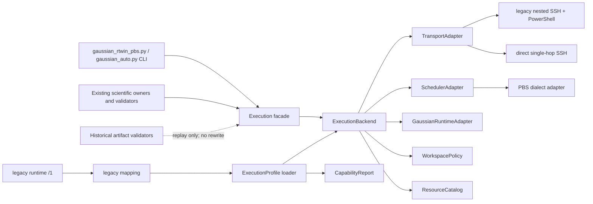
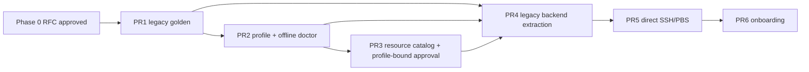

# Auto-G16 v2.6 平台可移植性基础 RFC

状态：Accepted；三项仓库所有者决议已于 2026-07-22 确认；不构成实现或运行授权<br>
任务分类：Feature development / L2 contract and compatibility review<br>
审阅基线：`aa1c4614fc0d1cdecfc445a4db39a70700e2d7c6`<br>
分支：`codex/v26-platform-rfc`<br>
审阅日期：2026-07-22（Asia/Shanghai）

## 1. 摘要与约束

本 RFC 建议将当前唯一的 Mac → RTwin/Windows → PBS/Gaussian 执行链先刻画为
`legacy_rtwin_pbs` backend，再在不改变科学 gate、历史 artifact 或现有 RTwin/PBS
安全语义的前提下增加 `direct_ssh_pbs` backend。v2.6 的完成边界是：

- 闭合、版本化且不含秘密的 execution profile 与 capability report；
- 完全离线的 profile template、validate 和 doctor；
- 通过 golden characterization 证明 legacy 行为没有漂移；
- legacy RTwin/PBS 与 direct SSH/PBS 两个显式 backend；
- profile-bound resource catalog，以及与 profile hash 绑定的 exact resource 人工批准；
- 明确拒绝未知 backend、capability、scheduler dialect、路径、资源或传输状态。

本 RFC 不修改代码或既有 schema，也不放宽 [`AGENTS.md`](../AGENTS.md) 的固定
`/home/user100/SDL` 政策。第 9 节的推荐方案只有在仓库所有者先批准并修改绑定规则后
才能实施；在此之前，所有 backend 都必须继续使用固定根。

本轮没有 SSH、RTwin、PBS、Gaussian、live smoke、Skill 部署或远程数据访问。

## 2. 基线、发布事实与审阅方法

### 2.1 本轮已核实事实

| 项目 | 2026-07-22 本轮事实 | 证据 |
| --- | --- | --- |
| Git 基线 | `HEAD`、本地 `main` 与刷新后的 `origin/main` 均为 `aa1c4614fc0d1cdecfc445a4db39a70700e2d7c6`，ahead/behind 为 `0/0` | 本轮只读 `git fetch origin --prune --tags` 与 `git rev-parse` |
| PR #49 | 已于 `2026-07-22T05:10:36Z` 合并，merge commit 为上述 SHA | [PR #49](https://github.com/anakine800-tech/Auto-Gaussian/pull/49) |
| tag | annotated tag `v2.5.4` peel 到上述 SHA | 本轮刷新后的 tag refs |
| Release | `Auto-Gaussian 2.5.4` 于 `2026-07-22T05:16:14Z` 发布，非 draft、非 prerelease，当前为 Latest | [v2.5.4 Release](https://github.com/anakine800-tech/Auto-Gaussian/releases/tag/v2.5.4) |
| 仓库版本 | `pyproject.toml`、README、CHANGELOG 与 repository status 均为 2.5.4 | [`pyproject.toml`](../pyproject.toml)、[`README.md`](../README.md)、[`CHANGELOG.md`](../CHANGELOG.md)、[`repository-status.md`](repository-status.md) |

因此，外部交接书中“可能仍无 v2.5.4 tag/Release”的描述已过时。v2.6 可以从已发布的
`v2.5.4` 精确提交开始；开始每个后续 PR 时仍须重新核实 `origin/main`，不能把本次 SHA
当作永久 current。

### 2.2 Preflight 事实

本 linked worktree 初始位于同一基线的 detached HEAD，工作区干净。首次 development
preflight 唯一 blocker 是 detached HEAD；建立用户指定的唯一分支
`codex/v26-platform-rfc` 后，普通、JSON 和 `--require-clean` 三种 preflight 均通过：
branch、linked worktree、clean tree、private-path classification、required files、live
environment 和 test-isolation 全部为 pass。

### 2.3 事实、推断和待决策分栏

| 类型 | 条目 |
| --- | --- |
| 事实 | [`gaussian_rtwin_pbs.py`](../skills/auto-g16-rtwin-pbs/scripts/gaussian_rtwin_pbs.py) 是 6255 行的主执行脚本；它同时拥有输入审计、legacy 配置、nested SSH、PowerShell、PBS、workspace、资源上限、stage/submit/inspect/watch/fetch/cancel 和 CLI。 |
| 事实 | 主脚本构造两跳 `ssh -F ... rtwin ssh -F ... gaussian-server ...`；fetch 另有 Windows PowerShell 编码阶段。 |
| 事实 | 主脚本固定 `DEFAULT_REMOTE_ROOT=/home/user100/SDL`、`MAX_CORES=44`、`MAX_MEMORY_BYTES=120 GiB`；资源模块固定 `simple=(8,12)`、`general=(22,50)`、`complex=(44,120)`。 |
| 事实 | [`gaussian_server.example.json`](../config/gaussian_server.example.json) 描述 scheduler、Gaussian 和资源，但当前执行代码不加载该文件；它不是现行 backend 合同。 |
| 事实 | 旧 runtime `/1` 是九字段 closed schema；PBS 主脚本只直接消费其中 `rtwin_ssh_config`、`windows_project_root`、`windows_server_config`，其余字段由 Python/ChemDraw/GaussView 侧消费或不属于 PBS transport。 |
| 事实 | `qsub`/active-job `qdel` 不自动重试；只有封闭的 read-only snapshot capability 可有限重试。unknown/timeout/parse failure 不得推断 absent。 |
| 事实 | stage 与 proposal 均显式 non-authorizing；当前 resource gate 要求 exact tier/cores/memory/walltime/estimated core-hours，并禁止自动资源改变和自动 retry。 |
| 推断 | 如果直接在 6255 行脚本中增加第二套条件分支，最可能出现的是命令形状、批准重放、unknown 状态或 fetch 完整性漂移。应先冻结 golden，再抽取。 |
| 推断 | profile hash 必须进入最终人工授权的传递闭包，而不能只出现在 capability report；否则批准后替换 backend/root/target 的风险仍存在。 |
| 推断 | PBS dialect 不是单一事实。v2.6 的 direct backend 只能支持被 fixture 明确定义的现行方言；未知输出必须 fail closed。 |
| 待决策 | v2.6 后续实现的精确基线策略、remote-root 政策、以及支持范围，见第 18 节的三个 owner decision。 |

## 3. 当前耦合与文件级迁移图

### 3.1 源文件清单

| 当前文件或文件组 | 已核实耦合/合同 | v2.6 处理方式 |
| --- | --- | --- |
| [`AGENTS.md`](../AGENTS.md) | 固定 `/home/user100/SDL`、禁止 remote-root override；submission/cancellation/cleanup 权限边界 | legacy 原样保留；任何新 root 先由 owner 修改规则，代码不得先行 |
| [`README.md`](../README.md)、[`end-to-end-reaction-computation-workflow.md`](end-to-end-reaction-computation-workflow.md)、[`auto-g16-rtwin-pbs/SKILL.md`](../skills/auto-g16-rtwin-pbs/SKILL.md) | 描述固定 root、RTwin 链、三档资源、批准和运行语义 | compatibility 文档；实现后才更新 support matrix，不预先宣称支持 |
| [`runtime.example.json`](../config/runtime.example.json)、[`scripts/runtime_config.py`](../scripts/runtime_config.py) | `auto-g16-runtime-config/1` closed schema、no-follow loader、九个 legacy 本机字段 | `/1` 冻结；新增独立 execution profile schema，不原地加字段 |
| `skills/auto-g16-rtwin-pbs/scripts/runtime_config.py` 与 `auto-g16-view-rt-win` 同名 loader | 部署 Skill 的 self-contained legacy loader | 保留 legacy 加载；新增 loader 必须单一 owner 并由 packaging manifest 映射，避免第三份漂移 |
| [`gaussian_server.example.json`](../config/gaussian_server.example.json) | 非执行代码所加载的说明性示例 | 不冒充兼容输入；Phase 1 转写为新的 sanitized template，旧文件继续保留 |
| [`gaussian_rtwin_pbs.py`](../skills/auto-g16-rtwin-pbs/scripts/gaussian_rtwin_pbs.py) | legacy 平台、workspace、PBS、Gaussian runtime、资源、fetch、状态、批准和 CLI 的组合 owner | 先 golden；再保留同名 CLI wrapper，逐步委托给 `legacy_rtwin_pbs` backend |
| [`gaussian_auto.py`](../skills/auto-g16-rtwin-pbs/scripts/gaussian_auto.py) | 直接 import 主脚本，并转发五个 connection 参数与所有 execution/resource 参数 | 保持 CLI；改为调用 backend-neutral facade，禁止重建批准 scope |
| [`gaussian_workflow.py`](../skills/auto-g16-rtwin-pbs/scripts/gaussian_workflow.py) | 从主脚本复用输入解析与 44/120 上限 | 只依赖 Gaussian input/runtime validator 与 ResourceCatalog，不依赖 transport |
| [`resource_efficiency.py`](../skills/auto-g16-rtwin-pbs/scripts/resource_efficiency.py) | 三档 tuple、policy/gate、snapshot、ledger `/3`、accounting、monitor reconciliation | 拆出 catalog；gate、unknown 和 append-only semantics 保持原 owner 语义 |
| [`execution_batch.py`](../skills/auto-g16-rtwin-pbs/scripts/execution_batch.py) | `/2` reservation 中固定 remote workdir；历史 `/1`–`/3` 迁移 | 旧 validator 原样重放；新版本通过 WorkspacePolicy 绑定 profile/root hash |
| [`protocol_selection.py`](../skills/auto-g16-rtwin-pbs/scripts/protocol_selection.py) | 只接受 closed resource tier labels，且 proposal 禁止 server/remote-root/submission 字段 | 保持 proposal 非授权；资源 tuple 由新 catalog 验证，不把科学 protocol 变成执行批准 |
| [`templates/g16_job.pbs.template`](../templates/g16_job.pbs.template) | 固定 SDL root、scratch containment 和 Gaussian 启动形状 | 纳入 legacy golden；新 renderer 生成等价 legacy bytes，direct 另有明确 fixture |
| `contracts/rtwin-pbs/*` | live approvals、execution batches、resource gate/snapshot 等历史合同；部分 schema 固定 SDL 路径 | 不就地修改；旧 validator 永久重放，profile-aware 行为使用新 schema/version |
| `auto-g16-main-group-open-shell/scripts/open_shell_minimum_family.py` | 再次固定三档 tuple | 后续消费 ResourceCatalog 的 legacy view；旧 artifact 仍按原 tuple 验证 |
| `auto-g16-ts-irc/scripts/ts_irc.py` | 固定 SDL 路径、三档 label、transport Skill 名称 | 只改未来 execution handoff；TS/Freq/IRC 科学 gate 不迁入 backend |
| `auto-g16-metal-ts/scripts/metal_ts.py` 与 `contracts/metal-ts/*` | 当前输入批准要求 SDL 路径 | 历史合同不改；direct backend 支持需由 metal owner 独立评审，不在 v2.6 自动扩大 |
| `auto-g16-reaction-workflow/scripts/calculation_artifacts.py`、`scientific_closure_lineage.py` | import/动态加载主执行 owner 的审计或批准函数 | 改为依赖稳定 facade；不得复制 validator 或改变 scientific classification |
| `auto-g16-rtwin-pbs/deployment-package.json` | 当前只额外打包 `contracts/rtwin-pbs` | 新 `contracts/execution` 若获批，必须显式加入 named-Skill package 并由 packaging tests 覆盖 |
| runtime/resource/execution/packaging 测试 | 冻结 closed schema、root、命令、unknown、no retry/no delete、hash/no-clobber、CLI 和部署 | 先扩展 golden，再做迁移；不得删除、弱化或用新测试替代原断言 |

此外，历史 smoke checklist、TS 设计文档、asymmetric fixtures 和 study artifact 中也存在
SDL/资源字面值。它们是历史事实或科学记录，不是批量替换目标；只有面向新 backend 的
说明才更新，历史 hash-bound bytes 不重写。

### 3.2 迁移依赖图



关键依赖方向是 scientific owner → non-authorizing execution request → exact human approval →
backend。backend 不能反向选择 method、route、TS algorithm、科学状态或接受结果。

## 4. 核心对象与最小接口

以下是 RFC 级最小合同，不是 Python API 承诺。实现可使用 dataclass/Protocol，但 JSON
边界必须 closed、版本化、严格拒绝 duplicate key、unknown field、非标准数字、空白字符串、
相对敏感路径、symlink 与 secret-like 内容。

### 4.1 ExecutionProfile

职责：描述一个明确、私有、机器本地的 execution backend 配置；不保存密码、私钥内容、
token 或任意 shell 字符串。

最小字段：

```text
schema, profile_id, backend_kind,
transport_config_ref, scheduler_dialect,
gaussian_runtime, workspace_policy, resource_catalog,
declared_capabilities, profile_payload_sha256
```

最小接口：`load_exact(path) -> ExecutionProfile`、`validate_closed(profile)`、
`canonical_projection(profile) -> bytes`、`profile_hash(profile) -> sha256`。

profile hash 必须覆盖 backend、target reference、scheduler dialect、Gaussian executable
reference、workspace root policy 和完整 resource catalog。凭据不进入 profile；profile 只引用
系统 SSH config/alias 等本地机制。任何被 hash 覆盖的字段变化都使旧 execution approval 失效。

### 4.2 CapabilityReport

职责：从已验证 profile 生成可以安全分享的只读摘要，不探测网络，不泄露 host、username、
绝对凭据路径或 SSH options。

最小字段：`schema`、`profile_id`、`profile_sha256`、`backend_kind`、scheduler/runtime
capability 状态、支持的 typed operations、显式 unsupported/unknown 列表、`offline_only=true`、
sanitization version 与 report payload hash。

最小接口：`build(profile) -> CapabilityReport`、`sanitize(report)`、`validate(report)`。
CapabilityReport 只陈述配置可表达性，不证明网络可达、许可证有效、Gaussian 可执行或 live
authority。

### 4.3 TransportAdapter

职责：只实现 backend 允许的 typed transfer/read-only operations。禁止
`run(command: str)`、任意 shell escape、caller-provided PowerShell/bash 字符串。

```text
capabilities() -> TransportCapabilities
build_readonly_snapshot(request: TypedReadRequest) -> CommandPlan
push_once(bundle, destination, exact_binding) -> TransferReceipt
pull_snapshot(source, destination, allowlist, expected_hashes) -> TransferReceipt
```

所有计划必须是参数数组或 adapter 内部固定脚本；有限 timeout；mutating operation 零自动
retry；只允许已证明 read-only 的 snapshot capability 采用现有有限 retry 规则；每跳 hash、
exact allowlist 和 incomplete snapshot 语义保持不变。

### 4.4 SchedulerAdapter

职责：拥有 scheduler 方言、脚本 rendering、submit-once、完整用户 scope snapshot、单 job
inspection、exact cancellation 和 accounting parsing。不得把 `Q/R/H/E`、self-purge、
scheduler zombie 或 unknown 压成简单 boolean。

```text
render(exact_resources, runtime_command, workspace) -> bytes
submit_once(script, exact_approval) -> SubmissionReceipt
inspect_exact(job_id) -> SchedulerObservation
inspect_active_scope(expected_ids) -> SchedulerScopeSnapshot
cancel_exact(job_id, exact_approval) -> CancellationReceipt
```

`submit_once` 和 `cancel_exact` 至多发出一次；uncertain 必须保留 reservation/intent，并只允许
read-only reconciliation。scheduler spool 永远不在接口中。

### 4.5 GaussianRuntimeAdapter

职责：验证 Gaussian executable reference、scratch policy、Link 0 resources 与 exact resource
tuple 一致，并构造封闭的 Gaussian invocation。它不选择 method/basis/solvent/route，不解释
normal mode，不将 Normal termination 提升为科学接受。

```text
capabilities() -> GaussianRuntimeCapabilities
validate_binding(input_audit, exact_resources, workspace) -> RuntimeBinding
build_invocation(input_basename, scratch_path) -> argv
```

当前 legacy `g16 <input>` 的命令形状先进入 golden；是否改为绝对 executable 只能由 profile
合同和兼容测试决定，不能根据 PATH 或 OS 自动猜测。

### 4.6 WorkspacePolicy

职责：验证 allowed root、project identity、canonical containment、fresh/non-empty 状态、
no-overwrite、no-symlink、scratch containment 和 no-delete。

```text
derive(project) -> WorkspacePaths
validate_root() -> CanonicalRootEvidence
plan_fresh_claim(project) -> WorkspaceClaimPlan
validate_existing_for_read(project) -> WorkspaceReadScope
```

接口没有 delete/cleanup/truncate。legacy 必须精确返回 `/home/user100/SDL/<project>`。

### 4.7 ResourceCatalog

职责：表达 profile 的 capacity 与 closed reviewed tuples，生成 non-authorizing proposal，并在
gate 前验证人工选择的 exact tuple。

```text
list_reviewed_tuples() -> tuple[ResourceTuple, ...]
propose(requirement, evidence) -> NonAuthorizingResourceProposal
validate_exact(tier, cores, memory_gb, walltime_seconds) -> ExactResourceTuple
bind(profile_sha256, exact_tuple, reviewer_record) -> ResourceApprovalBinding
```

proposal 必须包含 `proposal_only=true`、`calculation_ready=false`、
`no_submission_authorization=true`。系统不得根据探测到的 capacity 自动增加或减少资源。
exact cores、memory、walltime 和 tier 必须由人明确批准，并与 profile hash、input hash、task、
attempt 和 resource gate 绑定；任一变化都需要新批准。

legacy catalog 固定：`simple=8 cores/12 GB`、`general=22/50`、`complex=44/120`。
`custom_reviewed` 仍需 exact 人工批准，绝不是任意值逃生口。

### 4.8 ExecutionBackend

职责：组合上述组件并消费现有 owner validator 的已验证结果。它不是通用远程命令器，也不是
科学 orchestrator。

```text
capability_report() -> CapabilityReport
plan(request) -> NonAuthorizingExecutionPlan
stage(request, exact_bindings) -> ImmutableBundle
submit_once(bundle, authorizing_record) -> SubmissionReceipt
inspect/fetch/reconcile/cancel(typed_request) -> typed evidence
```

`plan` 永远不授权；`submit_once` 必须在第一次 network mutation 前重放 input、profile hash、
workspace、resource policy/gate、scheduler snapshot、execution batch、one-time live approval 和
idempotency binding。backend 不得改写上游结论。

## 5. 非授权 Execution Request 与授权闭包

新增 `auto-g16-execution-request/1`（名称待 owner 确认）只表达 intent：input hash、task/attempt、
work kind、profile ID/hash、required capabilities、proposed exact resources 和上游 artifact refs。
它必须 non-authorizing。

profile-aware live 路径需要新的 authorizing successor，而不是给既有 schema 原地加字段。最终
人工批准记录必须直接或通过不可变 binding hash 覆盖：

```text
input + scientific owner receipt
  + profile ID/hash + backend kind
  + exact target/workspace
  + exact tier/cores/memory/walltime
  + resource policy/gate/scheduler snapshot
  + batch/task/attempt/idempotency key
  + time window/revocation/single use/authorizations
```

旧 live approval、batch、gate 和 job artifact 均按原 validator replay；不得“补写” profile hash
或重新 hash 冒充新合同。新 direct backend 绝不接受 legacy-only approval。legacy 新提交在迁移
完成后也应使用 profile-aware successor；CLI 参数名可以保持不变，由 validator 按 schema
dispatch。具体 successor 编号须在实现 PR 中经 owner 审阅，Phase 0 不创建 schema。

## 6. 旧 runtime 到 `legacy_rtwin_pbs` 的兼容映射

### 6.1 字段级映射

| 旧 runtime `/1` 字段 | 当前 owner/用途 | legacy profile 映射 |
| --- | --- | --- |
| `rtwin_ssh_config` | PBS 主脚本直接读取 | `transport.mac_ssh_config_ref` |
| `windows_project_root` | PBS 主脚本直接读取，供 Windows staging/fetch | `transport.rtwin_workspace_root` |
| `windows_server_config` | PBS 主脚本直接读取，供第二跳 SSH | `transport.server_ssh_config_ref` |
| `windows_target` | view/Windows 工具使用；PBS 主脚本当前使用固定/CLI `rtwin_alias` | 保持 legacy runtime owner；不得误映射为 PBS 当前事实。若用户显式 CLI alias，则进入 profile projection |
| `windows_control_socket` | Windows/GaussView 控制 | capability extension，非 PBS execution core |
| `gaussview_exe` | 可视检查 | visualization capability，非 GaussianRuntimeAdapter |
| `core_python`、`rdkit_python` | 本机 Python profiles | 保留 runtime `/1` owner，不进入 execution profile hash |
| `chemdraw_pipeline_scripts` | 结构 pipeline | 保留 runtime `/1` owner，不进入 execution profile hash |

当前主脚本还保留 `GAUSSIAN_RTWIN_SSH_CONFIG` fallback，以及 CLI 的 `--mac-ssh-config`、
`--rtwin-alias`、`--windows-root`、`--windows-server-config`、`--server-alias`。这些 legacy 名称
在兼容期继续有效；映射后的精确值进入 derived profile hash。不得新增 remote-root CLI/env
override。

### 6.2 选择优先级

1. 显式新 execution profile：只使用该 profile；
2. 无新 profile但存在旧 runtime：严格映射为 `legacy_rtwin_pbs`；
3. 两者同时存在且 execution-relevant 值不一致：fail closed，输出不含秘密的冲突字段名；
4. 均不存在：保留当前 offline/default 诊断行为，但 live 操作仍因缺少 exact 配置/批准失败；
5. 不得按 OS、可执行文件、网络可达性或文件存在性静默选择另一 backend。

## 7. Legacy golden characterization

在重构前，从精确 v2.5.4 基线建立离线 golden，至少冻结：

- 旧 runtime JSON、环境变量和 CLI precedence，包括历史 fallback；
- `preflight`、`stage` 和 `gaussian_auto` dry-run 的 JSON field sets 与 non-authorizing markers；
- 普通与 resource-bound PBS script exact bytes，包括 job name、nodes/ppn、memory、walltime、
  resource tier、SDL realpath/symlink/scratch guards 和 `g16` invocation；
- `ssh_base`、nested SSH、PowerShell encoding、server claim、upload、per-hop hash、qsub intent/
  receipt、qstat、fetch、qdel 的 exact argv/script snapshots；
- qsub/qstat/process/qdel 的 success/absent/unknown/uncertain classification matrix；
- one-call inspection、complete-user qstat、termination-count unknown、held/exiting、stale、
  interrupted proof与scheduler-zombie repeated evidence；
- fetch exact allowlist、no scratch/unrelated files、partial target refusal、both-hop hash、immutable
  snapshot 和 exact log selection；
- execution batch `/1`→`/2`→`/3` replay、reservation/idempotency、resource gate、accounting、
  cancellation intent/receipt；
- all current public subcommands/options/help and stable error categories；
- no mutation in offline tests、no mutating retry、no delete、no remote-root override。

Golden harness 必须 mock `subprocess.run`、clock、random jitter 和 filesystem boundaries；任何
fixture 都使用 placeholder host/path/job ID。命令 snapshot 要比较结构化 argv 与固定脚本 bytes，
不能只查一个 substring。为避免把 bug 永久合理化，每个 golden 要标注“required compatibility”
或“known defect requiring separate reviewed change”；P0/P1 行为不能靠更新 golden 消失。

## 8. Direct SSH/PBS 的最小边界

`direct_ssh_pbs` 仅实现：

- 显式 profile 选择的一跳 SSH transport；
- 当前已刻画 PBS dialect 的 render、submit-once、inspect、complete user scope、exact cancel 与
  accounting；
- 同一 GaussianRuntimeAdapter、WorkspacePolicy、ResourceCatalog、approval/idempotency gate；
- server→client 一跳的 exact allowlist fetch 与 hash verification；
- 离线 template/validate/doctor、command snapshot 和 synthetic end-to-end fixture。

其命令 golden 必须证明无 Windows path、PowerShell、RTwin alias 或第二个 SSH。未知 dialect、
未批准 root、缺失 Gaussian executable reference、非空 project、symlink、profile drift、transport
timeout、ambiguous qsub/qstat 或 partial fetch 均 fail closed。

它不实现 GaussView、Windows staging、local Gaussian、Slurm、任意 ProxyCommand 生成器、任意
shell command、自动资源适配、自动 retry、自动 cancellation、server data cleanup 或科学接受。

## 9. 固定 remote root 的政策冲突

### 9.1 威胁模型

需要防御：profile/CLI 将 root 指向 `/`、home 或他人目录；`..`、相对路径、symlink/TOCTOU
逃逸；批准后替换 profile/root/host；错误 backend 使用另一台机器；上传覆盖已有项目；scratch
落到 `/tmp`；通用 transport 注入 shell；fetch 越权；把 scheduler cleanup 扩大为文件删除；
以及配置或 capability report 泄露凭据。

所有选项都必须继续 no-delete、fresh project、canonical realpath containment、no symlink、
no-overwrite、profile hash、exact approval 和 fail-closed unknown。

### 9.2 选项

| 选项 | 政策 | 优点 | 代价/风险 |
| --- | --- | --- | --- |
| A. 全局固定 | 所有 backend 只能使用 `/home/user100/SDL` | 完全符合当前 `AGENTS.md`；最小攻击面 | 陌生服务器必须迁就该路径，direct backend 可移植性有限 |
| B. legacy 固定 + backend-owned reviewed root | legacy 永远固定 SDL；新 backend profile 必填一个绝对 root，经 closed policy、profile hash、人工批准绑定；无 CLI/env override | 能支持不同受控集群，同时保持 legacy 无漂移 | **必须先由 owner 修改 `AGENTS.md`**；loader/approval/TOCTOU 测试面增加 |
| C. 仓库版本化 root registry | 每个 backend/profile ID 的 root 写入仓库 allowlist，变更走 PR/release；本机 profile 只能引用 ID | 审计最强，不允许个人任意 root | 每个新站点都要仓库变更，公共仓库可能暴露不必要的站点元数据，扩展慢 |

推荐 B，但它是有条件推荐：owner 未明确批准和修改规则时，自动回落 A，direct backend 只能
使用 SDL。B 的 root 必须是 backend-owned policy 的安全字段，不能是临时 CLI、环境变量或
“advanced override”；批准记录必须绑定 profile hash 和 canonical root evidence。C 可用于少数
共享受控站点，不作为公共用户默认。

## 10. Schema、versioning 与 packaging

- 冻结 `auto-g16-runtime-config/1`；新增 `auto-g16-execution-profile/1`，不做 `/1` in-place
  语义扩充。
- 候选新增 `auto-g16-execution-capability-report/1`、`auto-g16-execution-request/1`；最终名称和
  authorizing successor 在 owner 决策后逐个创建，不在一个 PR 批量预建空 schema。
- 所有新 schema `additionalProperties=false`、required=properties，并有 owner validator、
  duplicate-key/NaN/symlink/rehash-forgery tests。
- 旧 live approval `/1`–`/11`、execution batch `/1`–`/3`、resource policy/gate/snapshot、job、
  inspection、fetch、cancellation artifact 继续由原 validator replay；不 rewrite、不 backfill、
  不借新版本重新解释旧语义。
- `skills/` 继续是源码。v2.6 不重命名或删除 `auto-g16-rtwin-pbs`。shared execution modules
  初期由该 owner Skill 承载；新外部 contracts 通过 closed `deployment-package.json` 显式映射。
- named-Skill plan-review-apply 和 `test_skill_packaging` 保持不变。配置文件继续 ignored，永不
  打包真实 host/user/path/credentials。
- 接口稳定后才考虑一个 `auto-g16-execution` 薄入口或 MCP facade；它只能转发稳定 JSON/CLI，
  不复制 backend 或批准逻辑。

## 11. 兼容矩阵

| 表面 | v2.6 目标 | 不兼容时行为 |
| --- | --- | --- |
| 旧 `runtime.json` `/1` | 原 validator 和九字段继续有效；execution-relevant subset 映射 legacy profile | 冲突 fail closed，不静默迁移文件 |
| 旧环境变量 | README 列出的名称及代码中的 `GAUSSIAN_RTWIN_SSH_CONFIG` fallback 保留兼容期 | 与显式 profile 冲突时报告字段名并停止 |
| 旧 CLI/subcommands/options | 同名 wrapper、参数与 offline output 核心字段保持；backend 默认为明确映射的 legacy | unsupported backend 不降级 |
| legacy tiers | simple 8/12、general 22/50、complex 44/120 exact 保留 | tuple 不同即拒绝；可走 exact `custom_reviewed` |
| old live approvals | 原 schema 原样 replay；仅 legacy historical/in-flight 语境可按原合同解释 | 不可用于 direct；不伪造 profile hash |
| old job/fetch/inspection/cancellation | 原 validator、状态分类、hash/allowlist/idempotency 不变 | 新 adapter 不认识即交给 legacy replay 或明确 unsupported |
| execution batch/resource artifacts | `/1`–`/3` 迁移与 gate semantics 不变 | 新 profile-mode submit 需新 exact binding；历史 bytes 不改 |
| Skill name/package | `auto-g16-rtwin-pbs` 继续存在且可部署 | package diff/extra/missing file fail closed |
| server example | 保留为 legacy illustration；不宣称是可执行 profile | 用户必须显式生成/验证新 profile |

兼容不包括继续授权旧 artifact 去驱动新 backend。可重放历史与可用于新 live submit 是两个
不同合同。

## 12. 独立 worktree、branch、PR 序列

每项从当时核实的 default branch 建一个独立 Codex task、linked worktree、唯一 `codex/`
branch 和一个 PR；不得复用本 RFC worktree。

1. `codex/v26-legacy-golden`：只增加 legacy characterization fixtures/tests；不重构生产路径。
2. `codex/v26-execution-profile`：profile、capability report、offline init/validate/doctor、legacy
   mapping；无 network。
3. `codex/v26-resource-catalog`：legacy catalog、profile hash、non-authorizing proposal、exact
   human approval successor 与 resource gate binding。
4. `codex/v26-legacy-backend`：抽取 adapters/backend；旧 CLI wrapper 委托；golden 必须零漂移。
5. `codex/v26-direct-ssh-pbs`：一跳 SSH/PBS，仅 synthetic offline tests；不做 live。
6. `codex/v26-onboarding`：migration guide、support matrix、offline quickstart 与 issue template。



PR4 可在 PR3 设计审阅期间准备，但不得合并到未具备 profile-bound approval 的 direct live
路径。每个 PR 都必须独立回退；不使用跨 worktree 未提交依赖。

## 13. 为什么延后 local、Slurm 与 MCP

- local Gaussian 没有 transport/scheduler，却引入进程隔离、scratch、license/environment、
  signal/cancellation 和本机资源 accounting；用 PBS 抽象硬套会污染接口。
- Slurm 的 job ID、状态、自清理、资源语法、array/step/accounting 与 PBS 不同。尚未先证明
  PBS interface 的最小性时同时实现 Slurm，会把 PBS 偶然语义伪装成通用语义。
- MCP 是 agent transport，不是 execution safety owner。接口未稳定前建立 server 会多一套
  schema、权限、部署和远程命令攻击面，并诱导多个入口复制批准逻辑。
- 一次交付四类 runtime 无法用一个环境或一次 smoke 证明支持，且会显著增加 P0/P1 review
  surface。

因此 v2.6 只闭环 legacy + direct SSH/PBS；local、Slurm、MCP 分别在后续独立 RFC/版本，且
不得提前出现在 capability report 的 supported 列表。

## 14. 测试阶梯

每个实现 PR 按 [`development-handbook.md`](development-handbook.md) 记录命令、profile、
commit/tree hash、UTC 时间、exit code、test/skip/failure total、duration 和 modifiers。

1. 静态：strict JSON/schema、compileall、shell syntax、static quality、`git diff --check`、文档
   相对链接与 packaging manifest。
2. focused：profile loader/capability、adapter argv、workspace/root、resource tuple/profile hash、
   authorization successor。
3. 对抗：duplicate/unknown/NaN/symlink/traversal/profile drift；arbitrary shell；unknown dialect；
   timeout/ambiguous qsub；qstat unknown；non-empty workspace；partial/hash-mismatch fetch；exact
   cancel mismatch；unsupported local/Slurm/MCP 不降级。
4. legacy golden：旧 runtime/env/CLI、PBS bytes、nested commands、state matrices、fetch、qsub/
   qdel/idempotency、all historical validators。
5. adjacent：runtime config、gaussian auto gate、execution batch、resource monitor efficiency、
   runtime safety hardening、skill baseline/packaging，以及 open-shell/TS/reaction-workflow bridge。
6. synthetic offline integration：legacy 与 direct 各自从 profile → plan → stage → mocked submit/
   inspect/fetch；断言零真实 network。
7. full offline suite、Python contract、CI contract；release candidate 才做 `.git`-free source archive
   replay与版本 checklist。
8. live smoke：只在所有前述通过后另行提出 exact 授权；默认 `simple` 12 GB/8 cores，明确
   target/profile/input hash/resources/side effects/success/stop/evidence/cleanup。一次只测一个
   backend；失败不自动 retry/change/cancel/cleanup。

Phase 0 文档本身不需要也不允许 live smoke。静态 CI audit 只证明本地声明一致，不证明远端
branch protection 或 CI 成功。

## 15. 验收标准

### 架构

- scientific owners 不 import SSH/PBS/PowerShell implementation；backend 不选择或接受科学结论。
- 八个对象职责可独立测试；无自由 shell、动态 class name 或 OS-based backend selection。
- capability report 可机器读且脱敏；unknown/unsupported 明确。

### 兼容

- legacy golden 全通过；旧 CLI/runtime/env 的已承诺表面保持。
- legacy command/script/state/fetch/idempotency/root/resource 行为无未解释漂移。
- 历史 schema 与 artifact 由原 validator replay；没有 rewrite/backfill。

### 新能力

- direct profile 完全离线生成 capability、typed commands 和 PBS bundle；命令无 RTwin/
  Windows/PowerShell/second SSH。
- proposal 永远 non-authorizing；exact resources 与 profile hash 经人工批准后才可进入 submit。
- unsupported backend 明确拒绝，不 fallback。

### 安全与交付

- no automatic qsub/qdel retry、no delete、no non-empty overwrite、no symlink escape。
- remote-root owner decision 已写入绑定规则；否则只允许 SDL。
- 每个 PR 独立 worktree/branch/review/tests/rollback；L2 需要 independent reviewer。
- live、deployment、merge、tag、release 和 scientific acceptance 证据始终分开。

## 16. 风险

| 等级 | 风险 | 缓解/阻断条件 |
| --- | --- | --- |
| P0 | profile 偷偷放宽 remote root | owner 先决策；legacy 固定；无 CLI/env override；profile/root hash + realpath evidence |
| P0 | TransportAdapter 变成任意远程命令执行器 | typed operation、fixed scripts/argv、无 `run(str)`、snapshot adversarial tests |
| P0 | backend 绕过 live approval/resource gate/idempotency | 首次 network 前 replay 完整 authorizing closure；proposal 永不授权 |
| P0 | cancellation/cleanup 扩大到 server data | qdel 与 file deletion 分离；接口无 delete；现有 exact intent/one-shot 语义保留 |
| P1 | legacy 提取产生隐藏行为漂移 | golden 先行；旧 wrapper 保留一个版本；P1 golden diff 阻止合并 |
| P1 | profile 改变后旧批准仍可用 | profile hash 进入最终人工批准；pre-qsub 再验；变化需新批准 |
| P1 | 修改历史 schema 破坏 provenance | 新 schema/version；旧 bytes/validator 不改、不 backfill |
| P1 | PBS dialect 被错误泛化 | profile 显式 dialect；只支持有 fixture 的方言；parse unknown fail closed |
| P1 | package 内出现两套 owner/validator | 单一 source owner；closed deployment manifest；packaging/import tests |
| P1 | old CLI “兼容”被误解为 old approval 可驱动 direct | compatibility matrix 明确 replay vs new-live authority |
| P2 | v2.6 范围扩张到 local/Slurm/MCP | support matrix 标 unsupported；独立 RFC/版本 |
| P2 | 6255 行拆分造成长期双路径 | compatibility window 有期限；只允许 wrapper，不允许两套可变实现 |

P0/P1、required check 失败、偏离已确认的 owner 决议、golden 未解释变化、敏感内容、dirty
integration state 或任何未授权 live dependency 都阻止合并。

## 17. 迁移、回退、non-goals 与 stop conditions

### 迁移

先提供 offline doctor 展示 derived legacy profile ID/hash/capabilities，不写旧配置。用户可显式
生成新 profile，review diff 后切换。冲突时停止并给字段级提示。历史项目继续由 legacy
validator/adapter 管理；不批量迁移 artifact。

### 回退

- 每个 PR 可独立 revert；不可 force-push、删除历史 artifact 或自动回滚 server state。
- legacy wrapper 与旧实现保留至少一个兼容版本；若 golden、full suite 或 profile-bound
  approval 任一失败，direct backend 不启用，旧路径不删除。
- 新 profile 是 ignored local config；回退是显式选择 legacy mapping，不自动 fallback。
- 已发出的 uncertain intent/reservation 不因代码回退而清除，仍需原 read-only reconciliation。

### Non-goals

不改变 reaction/mechanism/TS/Freq/IRC/thermochemistry；不选择 method/route/resources；不修改
既有 schema；不实现 local/Slurm/MCP；不新增平台微型 Skills；不提供 arbitrary shell、remote
root override、自动资源扩张、自动 qsub/qdel retry、server file cleanup；不以 live smoke 代替
offline evidence。

### Stop conditions

- 本 RFC 已获 owner 批准，但当前 task 仍停止于 Phase 0；实现必须使用后续独立
  task/worktree/branch/PR，不在本 worktree 继续；
- 后续实现若偏离第 18 节已确认决议，须重新取得 owner 决策；
- remote-root 规则未正式修改，任何非 SDL profile 拒绝；
- legacy golden 不完整或出现未解释 diff，停止抽取/direct backend；
- profile hash 未进入最终 authorizing closure，停止任何 profile-mode live path；
- offline/adjacent/full test、CI contract 或 independent L2 review 有 P0/P1，停止集成；
- direct live compatibility 仍是未知时只报告未知；不得用 retry 或范围扩张补证据。

## 18. 仓库所有者决议（已确认）

决议记录：仓库所有者于 2026-07-22 对以下三项全部表示同意。该确认批准 RFC 方向，
不授权代码实现、schema 修改、push、PR、merge、部署、live smoke 或真实运行环境操作。

1. **版本基线：已批准。** 每个 v2.6 实现 PR 从当时刷新并确认的 `main` 开始，同时以
   `v2.5.4^{}` 的 `aa1c4614...` 作为 legacy golden 原点。v2.5.4 已发布；不再把发布状态当
   blocker，但后续 PR 仍重新核实 main。

2. **remote-root 政策：有条件批准选项 B。** legacy 永久固定 SDL；新 backend 使用
   mandatory、backend-owned、reviewed、hash-bound、不可 CLI/env 覆盖的 root。实现非 SDL
   root 前必须在独立任务中先修改并审阅 `AGENTS.md`；规则变更完成前使用选项 A，所有
   backend 仍固定 `/home/user100/SDL`。

3. **v2.6 支持边界：已批准。** 只支持 `legacy_rtwin_pbs` + `direct_ssh_pbs` + offline
   onboarding；local Gaussian、Slurm 和 MCP 明确标为后续版本 unsupported。先证明两个 PBS
   backend 共享的最小合同，再分别扩展。

## 19. 推荐后续任务序列

第 18 节决议已完成。下一步应按第 12 节依次新建 PR1–PR6 的独立 task/worktree/branch；本
Phase 0 task 到此停止，不进入代码或 schema 实现。任何 live smoke 另建 operational task 并
使用 owning Skill 的 exact approval，不与 feature PR 合并授权。

## 20. Phase 0 离线验证记录

本轮在 core Python 3.13.13、无 test coverage modifier 的本地 linked worktree 中完成：

- 三种 development preflight：首次 detached HEAD 唯一 blocker 被合规分支修复；修复后普通、
  JSON、`--require-clean` 均 exit 0；
- `./scripts/python check --profile core`：exit 0；
- `static_quality.py`：8 个高风险模块通过 4 条规则；
- `audit_python_contract.py` 与 `audit_ci_contract.py`：exit 0；两者均不证明远端 branch
  protection 或实际 CI 成功；
- 8 个 runtime/resource/execution/packaging 相邻模块：156 tests，41.449s，全部通过；
- `./scripts/python core scripts/run_tests.py --top-slow 20 --slow-threshold 1.0 --verbosity 1`：
  749 tests，472.871s，`OK (skipped=1)`；
- 本 RFC 24 个 Markdown links 均可解析，local missing=0；敏感字符串、private key、私有本机
  路径、Gaussian output/checkpoint 和真实 job artifact 扫描无命中。

这是作者自审和本地离线证据。L2 要求的 independent reviewer 尚未发生，仍是进入实现或
集成前的显式 gate。没有 source-archive release replay、远端 CI 证明或 live compatibility
证明；这些不能从本轮检查推断。
